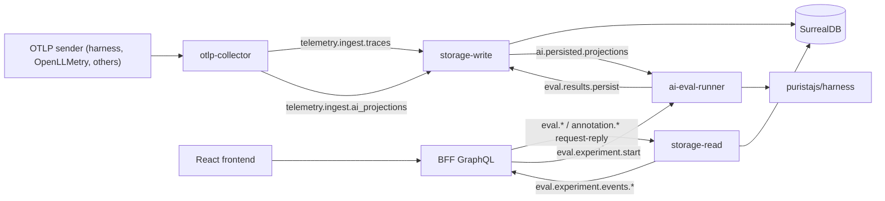

# CloudGrid AI Evaluation Module — Draft Module Spec

> **Status note.** This is a `proposal` document under `proposals/`, not part
> of `specs/`. It is written in cloudgrid's spec format so it can be promoted
> later, but no implementation should reference it as authoritative. Open
> questions are listed in §13.

## 1. Intent

CloudGrid's MVP is an OTel collector with a Jaeger-like trace/log UI, with AI
entities deliberately deferred (see `ADR-0003`). This module proposes an
**optional, separately deployable extension** that turns persisted AI-related
telemetry into a closed-loop evaluation and improvement workflow:

- **Observe** persisted spans that carry `gen_ai.*` or OpenInference
  attributes as first-class AI entities (agent run, model call, tool call,
  retrieval).
- **Evaluate** those entities — online (against live traces) and offline
  (against curated datasets) — with a registry of deterministic, RAG, and
  LLM-judge scorers.
- **Optimize** prompts and agent configurations by replaying datasets through
  `puristajs/harness` and surfacing comparable scoreboards.

The module never executes user prompts itself. All execution is delegated to a
configured harness instance. Cloudgrid owns ingest, derivation, persistence,
query, and presentation.

## 2. Scope

### 2.1 In scope

- Ingest-time normalisation of `gen_ai.*` and OpenInference attributes onto
  AI domain entities, in addition to the existing canonical span/log entities.
- A new domain (`ai-eval`) with entities for `AgentRun`, `LlmCall`, `ToolCall`,
  `RetrievalEvent`, `Dataset`, `DatasetItem`, `Scorer`, `EvalResult`,
  `Experiment`, `ExperimentRun`, `PromptVersion`.
- A new private service `core/ai-eval-runner` (Go) that orchestrates
  evaluation runs by issuing harness requests and writing results through
  storage-write.
- New NATS request/reply subjects under `eval.*` and a new persisted
  notification subject for completed eval runs.
- New GraphQL queries and mutations for AI domain entities, dataset
  management, scorer management, run start/stop, and result reads.
- New frontend views (gated by feature flag): agent-run timeline + transcript,
  dataset editor, scorer registry, experiment scoreboard, annotation queue.

### 2.2 Out of scope (explicit non-goals)

- No model-provider proxy or gateway. Provider-side capture is the
  responsibility of the emitting application's instrumentation (OpenLLMetry,
  harness, OTel SDKs).
- No bundled LLM-judge model. Judge models are configured per scorer and
  invoked by harness; cloudgrid never ships credentials.
- No multi-tenant SaaS. Authentication remains deferred per
  `specs/07-adr/0004-no-auth-for-local-mvp.md`.
- No replacement of cloudgrid core trace/log behaviour. AI entities are a
  projection; existing trace/log persistence and query continue unchanged.
- No metrics ingest in this module. Cost/token rollups are derived from spans
  using existing storage-read query semantics until OTLP metrics land per
  `specs/04-backend/telemetry-signal-roadmap.md`.

## 3. Boundary invariants

The boundaries from `AGENTS.md` and `specs/04-backend/backend-architecture.md`
extend unchanged. Restated for clarity:

- Frontend talks only to the TypeScript BFF (`apps/backend`).
- BFF talks to private services only through NATS bridge contracts.
- Storage-write is the only mutator of SurrealDB.
- Storage-read is the only fetcher from SurrealDB.
- Public reads are GraphQL only — no REST AI-eval endpoints.
- The BFF must not derive, aggregate, score, or correlate AI entities. All
  AI-domain query semantics are owned by storage-read.
- The new `ai-eval-runner` service must not read SurrealDB directly. It
  reads through storage-read NATS subjects and writes through storage-write
  NATS subjects.

## 4. Data model

The proposed domain extends `specs/01-domains/observability-data.md` without
mutating its entities. AI entities are derivations of existing spans/logs and
maintain pointers back to them.

### 4.1 Trace-derived entities (read-mostly)

These are derived during persistence by storage-write from incoming spans.
They are **projections**: deletion of source spans deletes the AI entities;
no AI-only data lives here.

| Entity | Derived from | Key attributes |
| --- | --- | --- |
| `AgentRun` | spans where `gen_ai.operation.name = invoke_agent` or OpenInference `AGENT` kind | `id`, `traceId`, `rootSpanId`, `agent.id`, `agent.name`, `agent.version`, `startedAt`, `endedAt`, `status`, `inputDigest`, `outputDigest`, `tokenTotals`, `costEstimate` |
| `LlmCall` | model spans (`chat`, `text_completion`, `embeddings`, `generate_content`, OpenInference `LLM`) | `id`, `traceId`, `spanId`, `provider`, `requestModel`, `responseModel`, `inputTokens`, `outputTokens`, `tokenCost`, `latencyMs`, `messageEventIds` |
| `ToolCall` | spans where `gen_ai.operation.name = execute_tool` or OpenInference `TOOL` | `id`, `traceId`, `spanId`, `toolName`, `parametersDigest`, `resultDigest`, `latencyMs`, `status` |
| `RetrievalEvent` | OpenInference `RETRIEVER` / `RERANKER` spans | `id`, `traceId`, `spanId`, `documentCount`, `topK`, `embeddingModel`, `latencyMs` |

`*Digest` fields are content-addressed hashes of payload events. Full content
remains in the source span events (per ADR-0003), gated by the existing
content-capture defaults.

### 4.2 Eval-domain entities (mutable, owned by ai-eval-runner via storage-write)

| Entity | Purpose | Key attributes |
| --- | --- | --- |
| `Dataset` | Versioned collection of evaluation items | `id`, `name`, `description`, `version`, `createdAt`, `itemCount`, `tags` |
| `DatasetItem` | One `{input, expected, metadata}` triple | `id`, `datasetId`, `version`, `input`, `expected`, `metadata`, `sourceTraceId?`, `sourceSpanId?`, `annotations[]` |
| `Scorer` | Registered scorer definition | `id`, `name`, `kind` (`deterministic` / `rag` / `llm_judge` / `human`), `definition`, `judgeModelRef?`, `version` |
| `EvalResult` | Score for one (target, scorer) pair | `id`, `scorerId`, `scorerVersion`, `targetKind` (`spanId` / `datasetItemRunId`), `targetId`, `score`, `passed`, `evidence`, `judgeRunRef?`, `producedAt` |
| `Experiment` | Named comparison container | `id`, `name`, `datasetId`, `datasetVersion`, `scorerIds[]`, `createdAt`, `tags` |
| `ExperimentRun` | One execution of an experiment with a specific solver | `id`, `experimentId`, `solverRef` (harness agent + version + promptVersionId), `status`, `startedAt`, `endedAt`, `summary` |
| `DatasetItemRun` | Result of one dataset item under one experiment run | `id`, `experimentRunId`, `datasetItemId`, `harnessRunId?`, `output`, `latencyMs`, `tokenTotals`, `evalResultIds[]` |
| `PromptVersion` | Versioned prompt text + variables | `id`, `name`, `text`, `variableSchema`, `hash`, `tag`, `createdAt`, `notes` |
| `AnnotationQueueItem` | A trace/span queued for human review | `id`, `targetTraceId`, `targetSpanId?`, `reason`, `assignedTo?`, `status`, `createdAt`, `resolvedDatasetItemId?` |

Authoritative JSON Schemas would live under
`specs/03-contracts/entities/ai/*.schema.json` once promoted.

### 4.3 ID conventions

Per `specs/00-conventions.md` (CNV-001):

- `traceId`, `spanId` reuse OpenTelemetry IDs unchanged.
- All AI entity IDs above use ULIDs; clients treat them as opaque strings.
- `Dataset.version` and `Scorer.version` are monotonic integers per entity.
- `PromptVersion.hash` is `sha256` of the canonicalised prompt definition.

## 5. Ingest path

### 5.1 OTLP collector responsibility

The existing `core/otlp-collector` (`TEC-BE-002` family) gains an
**AI-extraction step** between OTLP normalisation and NATS publish. This step:

1. Inspects span attributes for `gen_ai.*` and OpenInference markers.
2. Emits a `PersistAiProjectionCommand` alongside (not instead of) the
   existing `PersistTelemetryCommand`. The trace/log persistence path is
   unchanged.
3. Preserves all original attributes verbatim (ADR-0003 invariant).

The collector remains agnostic to evaluation: it never invokes scorers and
never derives `EvalResult`. AI projection is purely structural mapping of
already-present attributes.

### 5.2 Attribute precedence and normalization

The two OTel-flavored LLM conventions in the wild — OTel GenAI (`gen_ai.*`)
and OpenInference (`llm.*`, `tool.*`, `retrieval.*`, …) — are not
interchangeable. The exact attribute-by-attribute mapping and the
dispatch rules cloudgrid's projection step implements live in
[`04-otel-protocols.md`](./04-otel-protocols.md). Summary:

1. The discriminator is `gen_ai.operation.name` *or* `openinference.span.kind`,
   resolved in the order given in `04-otel-protocols.md` §3.1.
2. For canonical fields with equivalents in both specs, prefer `gen_ai.*`
   (the upstream standard); fall back to OpenInference; preserve every
   raw attribute regardless (ADR-0003 invariant).
3. Four OpenInference span kinds have no OTel gen_ai equivalent today
   (`RETRIEVER`, `RERANKER`, `GUARDRAIL`, `EVALUATOR`). Cloudgrid models
   `RetrievalEvent` from `RETRIEVER`; the other three persist as raw
   spans for now.
4. Cloudgrid stamps `cloudgrid.ai.semconv.flavor ∈
   {gen_ai, openinference, both, neither}` on every projected span for
   debuggability.
5. On conflicting values for the same canonical field, attach
   `cloudgrid.ai.normalization.warning` to the source span (warning
   grade, non-fatal).

### 5.3 NATS subjects (additions)

Additions to `specs/03-contracts/messages/message-bridge.asyncapi.yaml`:

| Subject | Type | Producer | Consumer |
| --- | --- | --- | --- |
| `telemetry.ingest.ai_projections` | JetStream | otlp-collector | storage-write |
| `ai.persisted.projections` | JetStream | storage-write | ai-eval-runner, storage-read |
| `eval.dataset.create` / `eval.dataset.get` / `eval.dataset.search` | request/reply | BFF | storage-read |
| `eval.scorer.create` / `eval.scorer.get` / `eval.scorer.search` | request/reply | BFF | storage-read |
| `eval.experiment.start` | request/reply | BFF | ai-eval-runner |
| `eval.experiment.cancel` | request/reply | BFF | ai-eval-runner |
| `eval.experiment.get` / `eval.experiment.search` | request/reply | BFF | storage-read |
| `eval.results.search` | request/reply | BFF | storage-read |
| `eval.live.start` / `eval.live.stop` | request/reply | BFF | storage-read |
| `eval.experiment.events.<sinkId>` | ephemeral pub/sub | ai-eval-runner | BFF (per subscription) |
| `annotation.queue.search` / `annotation.item.update` | request/reply | BFF | storage-read / storage-write |

Naming follows the existing `telemetry.*` pattern; new top-level prefixes
`eval.*` and `annotation.*` keep them discoverable. All envelopes preserve
`BridgeEnvelope.authContext` per `CNV-001`.

## 6. Service architecture



### 6.1 New service: `core/ai-eval-runner` (Go)

- Responsibilities: orchestrate `ExperimentRun` lifecycle. For each
  `DatasetItem`, issue a harness request through a configured adapter and
  collect the output; invoke scorers; persist `DatasetItemRun` and
  `EvalResult` via storage-write. Emit live events to BFF-owned ephemeral
  subjects. Handle online evaluation by consuming
  `ai.persisted.projections` and running configured online scorers against
  matching projections.
- Boundaries: must not read or write SurrealDB. Must not call model
  providers directly. Must call harness over an explicit harness adapter
  port (HTTP or local exec, per harness deployment).
- Storage adapter pattern: `core/ai-eval-runner/internal/adapters/<harness>/`
  mirrors the storage-read/write adapter convention. v1 ships a
  `harness-http` adapter only.
- Build tag: `aieval` (sibling to existing `surrealdb`). Operators can build
  cloudgrid without ai-eval if they don't run AI workloads.

### 6.2 Harness integration contract

The `harness-http` adapter calls a long-running harness instance through a
small JSON-over-HTTP contract:

```
POST /v1/run
{
  "solver": { "agentName": "...", "version": "...", "promptVersionId": "..." },
  "input": <DatasetItem.input>,
  "metadata": { "experimentRunId": "...", "datasetItemId": "..." }
}
→ 200 { "harnessRunId": "...", "output": ..., "tokenTotals": ..., "spans": [...] }
```

Harness already emits OTel spans for these runs; cloudgrid associates them
with the `experimentRunId` via the standard trace context propagated in the
HTTP request. No new SDK is required on the harness side.

## 7. Storage-read query semantics (additions)

Per `TEC-BE-008` ("dumb client, smart backend"), all AI-domain query
semantics are owned by storage-read. New query capabilities:

### 7.1 Required pushdown

- Agent-run search: filters by `agent.id`, `agent.name`, status, time range,
  duration, token totals, cost-estimate range, root-trace existence,
  `experimentRunId`, free-text on input/output digest tags.
- Dataset-item search: filters by `datasetId`, `version`, source-trace
  presence, tag, free-text on metadata.
- Eval-result search: filters by `scorerId`, `scorerVersion`, target kind,
  pass/fail, score range, target trace/span, time range, `experimentRunId`.
- Experiment scoreboard aggregations: per `(experimentId, scorerId)` —
  count, mean score, p50/p95, pass-rate; per `(datasetItemId, experimentId)`
  cross-tab for diffing two runs.
- Annotation-queue facets: status counts, reason counts, assignee counts.

### 7.2 Allowed code-side derivations

Same allowance as `TEC-BE-008`: derivations stay local to a storage-read
adapter helper, include a comment explaining why pushdown is impractical,
and have focused tests. Expected derivations:

- Score-distribution histogram bucketing when SurrealDB lacks native
  histograms.
- Dataset-item / experiment-run cross-tab when SurrealDB cannot pivot
  natively.

### 7.3 Live experiment events

`eval.live.start` mirrors the existing `telemetry.traces.live.start`
contract. The runner emits `ExperimentEvent` messages to a BFF-owned
ephemeral subject, with event types `started`, `item_completed`,
`progress`, `heartbeat`, `finished`, `error`.

## 8. Public GraphQL surface (additions)

Additions to `specs/03-contracts/graphql/public-schema.graphql` (sketched
here, not normative). Naming follows the existing `Trace*` / `Span*`
conventions.

```graphql
type AgentRun {
  id: ID!
  traceId: ID!
  agent: AgentIdentity!
  status: AgentRunStatus!
  startedAt: DateTime!
  endedAt: DateTime
  durationMs: Int
  tokenTotals: TokenTotals
  costEstimate: Money
  rootSpan: Span!
  llmCalls: [LlmCall!]!
  toolCalls: [ToolCall!]!
  evalResults: [EvalResult!]!
}

type Dataset { id, name, version, itemCount, items(input: DatasetItemSearchInput): [DatasetItem!]! }
type DatasetItem { id, input, expected, metadata, sourceTrace: Trace }
type Scorer { id, name, kind, version }
type Experiment { id, name, dataset: Dataset!, scorers: [Scorer!]!, runs: [ExperimentRun!]! }
type ExperimentRun {
  id, status, startedAt, endedAt,
  summary: ExperimentRunSummary!,
  itemRuns(input: DatasetItemRunSearchInput): [DatasetItemRun!]!
}

extend type Query {
  agentRuns(input: AgentRunSearchInput!): AgentRunConnection!
  datasets(input: DatasetSearchInput): DatasetConnection!
  scorers(input: ScorerSearchInput): ScorerConnection!
  experiments(input: ExperimentSearchInput): ExperimentConnection!
  experimentRun(id: ID!): ExperimentRun
  evalResults(input: EvalResultSearchInput!): EvalResultConnection!
  annotationQueue(input: AnnotationQueueSearchInput!): AnnotationQueueConnection!
}

extend type Mutation {
  createDataset(input: CreateDatasetInput!): Dataset!
  appendDatasetItems(input: AppendDatasetItemsInput!): Dataset!
  promoteSpanToDatasetItem(input: PromoteSpanInput!): DatasetItem!
  createScorer(input: CreateScorerInput!): Scorer!
  createExperiment(input: CreateExperimentInput!): Experiment!
  startExperimentRun(input: StartExperimentRunInput!): ExperimentRun!
  cancelExperimentRun(id: ID!): ExperimentRun!
  resolveAnnotation(input: ResolveAnnotationInput!): AnnotationQueueItem!
}

extend type Subscription {
  liveExperimentRun(input: LiveExperimentRunInput!): ExperimentRunEvent!
}
```

All BFF resolvers continue to be dumb: validate input → request/reply via
NATS → validate reply → map to GraphQL. No filtering, aggregation, or
scoring in the BFF.

Errors continue to use `GraphQLError.extensions.problem` with codes from
`specs/03-contracts/errors.yaml`. New error codes (proposed):

- `ERR-AIE-001 EVAL_DATASET_NOT_FOUND`
- `ERR-AIE-002 EVAL_SCORER_NOT_FOUND`
- `ERR-AIE-003 EVAL_HARNESS_UNREACHABLE`
- `ERR-AIE-004 EVAL_RUN_LIMIT_EXCEEDED`
- `ERR-AIE-005 EVAL_PROJECTION_AMBIGUOUS` (warning-grade)

## 9. Frontend surface

The frontend remains dumb (`specs/05-frontend/frontend-application.md`); AI
panels render GraphQL view models and own only local presentation state.

### 9.1 New views (gated by `CLOUDGRID_AI_EVAL_ENABLED`)

- **AgentRun timeline**: trace waterfall augmented with agent-step grouping,
  tool-call rows, retrieval rows, and per-call token/cost columns.
- **Conversation transcript**: alternative presentation for long agent runs
  (Laminar pattern).
- **Datasets view**: list, edit, version, and filter dataset items.
  "Promote span to dataset item" action available from any persisted span
  detail.
- **Scorer registry**: list, create, edit deterministic / RAG / LLM-judge /
  human scorers.
- **Experiment scoreboard**: per-experiment view with side-by-side runs,
  p50/p95 score, pass-rate, regression highlight, per-item diff view.
- **Annotation queue**: triage view filtered by reason, assignee, status.

When the flag is off, none of these routes render; the AI domain types are
optional in the GraphQL schema and clients without the flag never query
them.

## 10. Run lifecycle (offline experiment)

```
1. User creates Dataset (manually or by promoting spans).
2. User creates Scorers (deterministic + LLM-judge as needed).
3. User creates Experiment (Dataset + Scorers + solver).
4. User starts ExperimentRun:
   BFF → eval.experiment.start (request/reply) → ai-eval-runner.
5. Runner loads dataset items via storage-read.
6. For each item:
   a. Runner calls harness with solver + input.
   b. Harness emits OTel spans (cloudgrid ingests them as normal traces).
   c. Runner stores DatasetItemRun via storage-write.
   d. Runner invokes scorers (deterministic locally; LLM-judge through
      a configured judge harness).
   e. Runner stores EvalResult records via storage-write.
   f. Runner emits live event to BFF subscription.
7. On completion, runner stores ExperimentRun.summary and emits final event.
```

CLI invocation (proposed): `cloudgrid eval run --experiment <id>` is a thin
wrapper over `eval.experiment.start` that streams the live subscription to
stdout and exits non-zero on regression versus a configured baseline.

## 11. Run lifecycle (online evaluation)

```
1. User configures online scorers per agent (or globally).
2. storage-write emits ai.persisted.projections after persisting an AgentRun.
3. ai-eval-runner consumes the notification, loads matching configured
   scorers, executes them (deterministic locally; LLM-judge through harness).
4. Runner persists EvalResult via storage-write.
5. If the result triggers an annotation rule (low score, error, thumbs-down),
   runner enqueues an AnnotationQueueItem.
```

Online scoring is rate-limited by configuration to bound cost. Harness-based
judges run with a separate provider key from production agents.

## 12. Optimization — TypeScript-only via harness workflows

### 12.1 Constraint

CloudGrid is TypeScript + Go. Python is not part of the deployment surface.
DSPy, TextGrad, and ax-llm's `MIPROv2` (which proxies to a Python Optuna
service) are out of scope on that basis. See `01-research.md` §6 for the
full evaluation. Optimization is implemented entirely as harness workflows.

### 12.2 Data model (additive, no entity changes)

`OptimizationRun` is **not** a new entity. It is an `ExperimentRun` whose
`solverRef.kind = "optimizer"`. Its outputs are:

- one or more candidate `PromptVersion` records (newly created), and
- one or more child `ExperimentRun` records evaluating each candidate
  against the dataset using the parent's scorers.

Promotion to a tag (e.g. `production`) is a user mutation
(`promotePromptVersion(id, tag)`); cloudgrid never auto-promotes.

### 12.3 Optimizer kinds (v1)

The `ai-eval-runner` does not understand optimization algorithms. It
delegates to one of two harness-resident workflows, identified in
`solverRef.optimizerKind`:

| `optimizerKind` | Algorithm | Implementation |
| --- | --- | --- |
| `bootstrap-fewshot` | Filter successful traces from the seed run, package the top-N as few-shot demonstrations attached to the base prompt. | Wrap `ax-llm/ax`'s `AxBootstrapFewShot` (pure TS) inside a harness workflow. Output: one candidate `PromptVersion` whose `text` is the base prompt and whose `metadata.demos[]` carries selected demonstrations. |
| `critic-mutate-judge-pick` | LLM-driven prompt rewriting. For each round: a *critic* agent reviews failing items and proposes mutation directions; a *mutator* agent applies them to produce N candidate prompts; each candidate is evaluated across the dataset; an Elo-style judge ranks them; the top-K survive to the next round. | Native harness workflow (no third-party optimizer). Uses standard PURISTA agents and `Workflow` orchestration; reuses cloudgrid scorers as the fitness function. |

`bootstrap-fewshot` is the v1 default because it is deterministic given a
seed dataset, cheap, and produces auditable changes. `critic-mutate-judge-pick`
is opt-in for cases where instruction text itself needs to change.

### 12.4 Runner contract

The harness-http adapter exposes one extra endpoint:

```
POST /v1/optimize
{
  "optimizerKind": "bootstrap-fewshot" | "critic-mutate-judge-pick",
  "basePromptVersionId": "...",
  "datasetId": "...", "datasetVersion": N,
  "scorerIds": [...],
  "config": { "rounds": 3, "candidatesPerRound": 4, ... },
  "metadata": { "experimentRunId": "..." }
}
→ 200 {
  "candidates": [
    { "promptVersionId": "...", "summary": { "score.mean": 0.83, "passRate": 0.91, ... } }
  ]
}
```

The runner persists the candidate `PromptVersion` records and child
`ExperimentRun`s as they appear (streamed, not batched at the end).

### 12.5 What this gives up vs DSPy

`bootstrap-fewshot` gives up DSPy's grounded-proposal step (which uses
program code introspection). `critic-mutate-judge-pick` gives up
MIPROv2's Bayesian search over the joint instruction × demo space —
replaced by Elo-style tournament selection, which is empirically
competitive for the prompt-text dimension but less efficient at exploring
demo combinations. If a future evaluation shows this gap matters, the
fallback is to call out to a hosted optimizer service over HTTP, not to
add a Python runtime to the deployment.

### 12.6 No model-provider credentials in cloudgrid

Optimization workflows necessarily make many model calls. All of those
calls happen inside harness using the operator's configured model
adapter. Cloudgrid's `ai-eval-runner` does not see prompts, completions,
or provider keys; it only sees `PromptVersion.id` and run summaries.

## 13. Open questions (must resolve before promoting to specs/)

1. **Storage adapter for AI eval volumes.** Confirm that SurrealDB is
   acceptable for online scoring of every persisted projection, or scope a
   columnar sibling adapter from day one. Reference
   `specs/04-backend/telemetry-signal-roadmap.md` future-storage section.
2. **Harness deployment model.** Is harness embedded as a sibling service
   in the same compose, or operated externally? The `harness-http` adapter
   accommodates both, but documentation and defaults need a primary path.
3. **Content capture defaults.** ADR follow-up to ADR-0003: under what
   conditions is full prompt/completion content stored, and where does it
   live (span events vs. a separate content store)?
4. **Eval-runner scaling.** A single runner is fine for v1. The concurrency
   model (per-experiment workers vs. shared pool) and idempotency
   guarantees need a dedicated NFR.
5. **Scorer registration source of truth.** Are scorers code-defined (Go /
   TS plugins) or data-defined (rows in storage)? Recommendation: code for
   shipped built-ins, data for project-specific LLM-judge prompts.
6. **GraphQL schema cohesion.** Whether AI types live alongside trace/log
   types in `public-schema.graphql` or in a separate generated schema
   federated together. Affects the BFF resolver layout.
7. **Naming.** "Module", "domain", "extension" all appear in this draft.
   Cloudgrid's spec vocabulary should pick one before promotion.
8. **Scorer library dependency.** Confirm that the v1 scorer set wraps
   `autoevals` (MIT, npm) for RAG and LLM-judge metrics rather than
   re-implementing Ragas-style metrics from scratch. Decision affects the
   `Scorer.definition` schema.
9. **Optimizer ownership.** `bootstrap-fewshot` is straightforward to
   embed in harness. `critic-mutate-judge-pick` introduces non-trivial
   prompts and judges that need their own versioning. Decide whether the
   optimizer prompts ship as cloudgrid-built-ins (versioned with the
   release) or as user-editable harness skills.

## 14. Promotion checklist (when this proposal moves into `specs/`)

- [ ] New domain spec under `specs/01-domains/ai-eval.md`.
- [ ] New backend specs under `specs/04-backend/ai-eval-runner.md` and
      `specs/04-backend/ai-eval-projection-mapping.md`.
- [ ] Capability specs under `specs/02-capabilities/ai-eval/*.md`.
- [ ] New ADRs for: storage adapter strategy, content capture, harness
      adapter contract, TypeScript-only optimization stance, scorer-library
      dependency choice.
- [ ] New entity JSON Schemas under `specs/03-contracts/entities/ai/`.
- [ ] New AsyncAPI subjects in `specs/03-contracts/messages/message-bridge.asyncapi.yaml`.
- [ ] New error codes in `specs/03-contracts/errors.yaml`.
- [ ] GraphQL schema additions in `specs/03-contracts/graphql/public-schema.graphql`.
- [ ] Frontend specs under `specs/05-frontend/ai-eval-views.md`.
- [ ] NFRs: `06-nfr/ai-eval-content-capture.md`, `06-nfr/ai-eval-cost-bounds.md`.
- [ ] Update `specs/spec.md` index and `specs/00-architecture-overview.md`
      Public API Inventory.

## 15. References

- Companion research document: [`01-research.md`](./01-research.md)
- `specs/00-vision.md`
- `specs/00-architecture-overview.md`
- `specs/00-conventions.md`
- `specs/04-backend/backend-architecture.md`
- `specs/04-backend/telemetry-query-semantics.md`
- `specs/04-backend/telemetry-signal-roadmap.md`
- `specs/07-adr/0003-preserve-genai-attributes.md`
