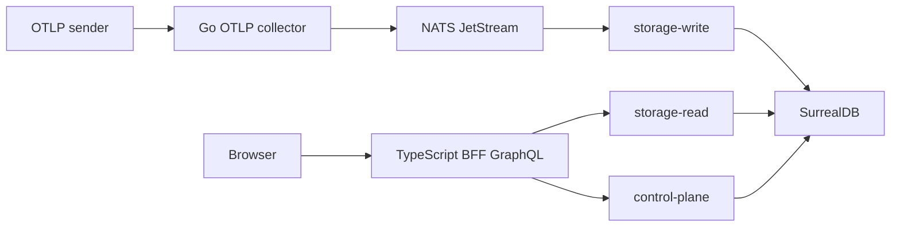

# Overview

CloudGrid is an AI-native observability application for OpenTelemetry traces, logs, and metrics. It receives OTLP HTTP and OTLP/gRPC traffic, stores telemetry behind private Go services, and exposes project, trace, log, metric, dashboard, alert, retention, and live trace workflows through one GraphQL boundary.

## What CloudGrid Does

- Accepts OTLP HTTP traces at `POST /v1/traces`.
- Accepts OTLP HTTP logs at `POST /v1/logs`.
- Accepts OTLP HTTP metrics at `POST /v1/metrics`.
- Accepts OTLP/gRPC traces, logs, and metrics on the standard gRPC collector port.
- Stores telemetry in SurrealDB through private storage services.
- Shows trace search/detail, log search/detail, metrics exploration, dashboards, alert rule configuration/history, retention policy settings, and live trace receiving in the browser.
- Organizes telemetry by company, project, and project-specific membership.
- Supports local no-login mode and deployed SSO mode.

## Implemented And Remaining Boundaries

Implemented:

- OTLP/HTTP JSON and protobuf on port `4318` for traces, logs, and metrics.
- OTLP/gRPC protobuf on port `4317` for traces, logs, and metrics.
- Project-specific membership and roles.
- Project ingest API key management.
- Project retention policy CRUD.
- Project alert rule, silence, and in-app alert history foundations.

Still separate production-readiness work:

- storage-maintenance retention deletion execution;
- alert evaluator scheduling/execution;
- non-core notification adapters;
- production deployment manifests;
- dedicated log-ingest service extraction.

## Runtime Modes

CloudGrid has two operating modes.

| Mode | Use it for | Login | Company model | Project model |
| --- | --- | --- | --- | --- |
| `local` | Development, local evaluation, demos on a trusted machine | No login | One local company | Multiple projects |
| `deployed` | Shared environments and future SaaS deployment | SSO through GitHub, Google, or Azure Entra ID | Multiple companies | Multiple projects per company |

Local mode is intentionally simple. It is not safe to expose to untrusted networks because it skips login. Deployed mode requires SSO and uses a BFF-managed session cookie; the frontend never stores provider access tokens.

## The Main Flow

The browser talks only to the BFF. The BFF talks to private services through NATS request/reply. Storage services own database access. This separation keeps future read authorization, ingest authorization, and tenant isolation enforceable in one place per responsibility.

## Next Step

Run the local stack in [Getting Started](../01-getting-started/README.md).
