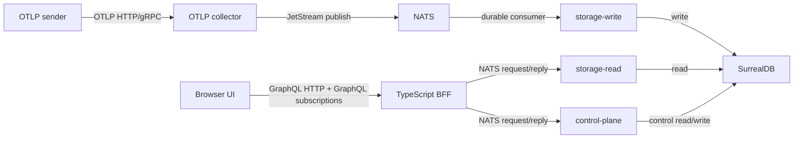
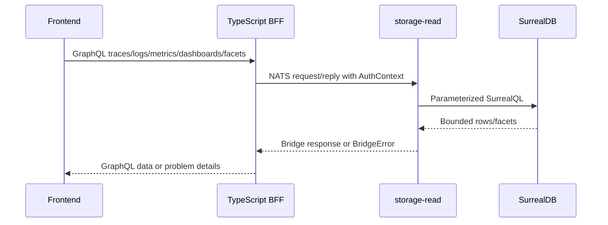
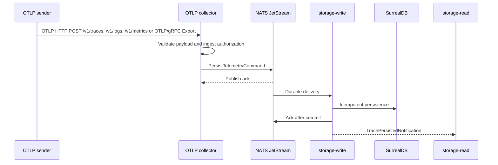
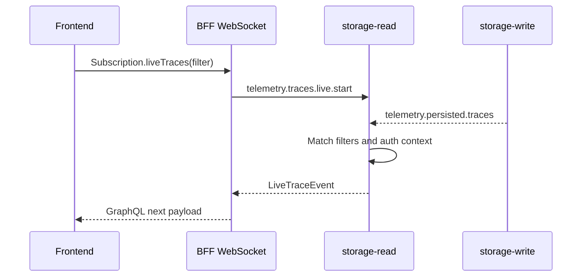

# Architecture

CloudGrid is split into a public BFF, private Go services, NATS, and SurrealDB. The split is intentional: each service owns one security and performance boundary.

## System Context

## Public Boundary

The TypeScript BFF is the only public application backend.

It owns:

- `/graphql`
- GraphQL subscriptions
- `/auth/login`
- `/auth/callback`
- `/auth/logout`
- health endpoints
- static frontend serving

It does not own telemetry query semantics. It validates inputs, maps public errors, carries auth context, and calls private services through NATS.

## Private Services

| Service | Owns | Must not do |
| --- | --- | --- |
| `core/otlp-collector` | OTLP HTTP and gRPC trace/log/metric ingest, ingest auth, project-status cache, JetStream publish | Read or write SurrealDB |
| `core/storage-write` | JetStream consumption, idempotent telemetry persistence, post-persist notifications | Serve public reads |
| `core/storage-read` | Trace/log/metric/facet/live read semantics and SurrealDB query pushdown | Mutate telemetry |
| `core/control-plane` | Companies, users, company memberships, project memberships, projects, project status, ingest credential metadata, dashboards, dashboard pins, retention policies, alert rules, alert silences, alert history | Read, write, or enrich telemetry |

## Read Path

Storage-read owns filters, sorting, cursors, counts, facets, log correlation, metric aggregation, metric grouping, metric descriptor lookup, and trace-detail view-model derivation. Control-plane owns project selection, project membership, ingest credentials, dashboard list/save/delete, dashboard pins, retention policy CRUD, alert rule CRUD, alert silences, and alert history persistence. The frontend renders GraphQL view models and keeps only presentation state.

## Write Path

The collector returns after JetStream publish ack, not after database persistence. Storage-write handles retries through JetStream redelivery and idempotent command IDs. The collector accepts OTLP/HTTP JSON, OTLP/HTTP binary protobuf, and OTLP/gRPC protobuf for traces, logs, and metrics. HTTP defaults to `0.0.0.0:4318` through `CLOUDGRID_OTLP_HTTP_ADDR`; gRPC defaults to `0.0.0.0:4317` through `CLOUDGRID_OTLP_GRPC_ADDR`.

## Realtime Path

GraphQL subscriptions remain the only public realtime protocol.

The BFF does not consume ingest streams or persisted telemetry streams directly. Storage-read owns live matching so future read authorization remains centralized.

## Tenancy Model

Local mode:

- one local company
- multiple projects
- local SurrealDB namespace with project databases

Deployed mode:

- multiple companies
- one tenant namespace per company
- one strict telemetry database per project
- central control-plane database for organizations, users, company memberships, project memberships, projects, ingest credentials, project status, dashboard configuration, retention policies, and alerting foundation records

Telemetry records include `tenantId`, `companyId`, and `projectId` metadata as defense in depth even though physical database separation already scopes data.

## Security Model

- Frontend talks only to the BFF.
- BFF talks to private services only through NATS request/reply.
- Collector validates ingest authorization before publishing commands.
- Storage-read validates read context before executing telemetry queries.
- Storage-write persists ownership metadata but does not decide read authorization.
- Dashboards and dashboard pins are project-scoped control-plane configuration, not browser-local truth.
- SurrealDB credentials are private to storage/control-plane service processes.
- Browser sessions use BFF-managed HttpOnly cookies in deployed mode.

## Scaling Shape

The designed scale path is horizontal at service boundaries:

- more BFF instances for GraphQL HTTP/WebSocket load
- more collector instances for OTLP HTTP and OTLP/gRPC ingest
- shared durable JetStream consumers for storage-write workers
- storage-read replicas for request/reply reads
- SurrealDB project databases and indexes for data isolation and query locality

The implementation-ready scaling requirements live in [performance and scaling](../../specs/06-nfr/performance-and-scaling.md).
