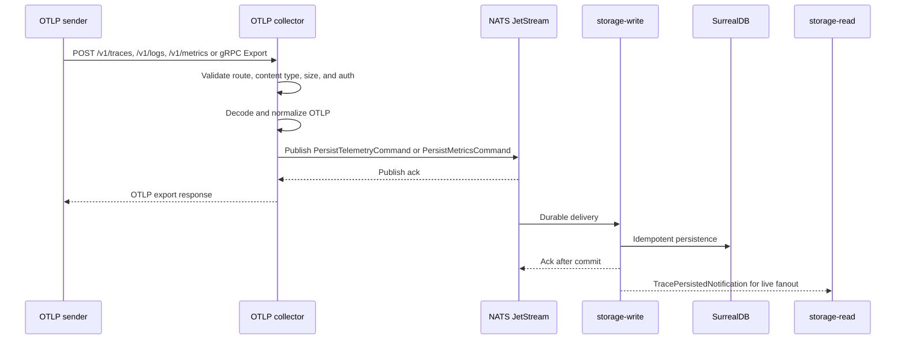

# Ingest Flow

The ingest flow accepts OTLP data, publishes one persist command, and lets storage-write persist asynchronously.

## Sequence

## Important Semantics

- Authentication and authorization happen before body decode except method, content-type, and request-size checks.
- HTTP `200` means the command was accepted by JetStream, not that data is already queryable.
- storage-write acknowledges only after persistence succeeds.
- post-persist notifications contain trace IDs and non-sensitive routing hints only.
- project ownership comes from auth context or local token mapping, not OTLP attributes.

## Subjects

| Signal | Subject |
| --- | --- |
| Traces | `telemetry.ingest.traces` |
| Logs | `telemetry.ingest.logs` |
| Metrics | `telemetry.ingest.metrics` |

## Failure Examples

| Failure | Error |
| --- | --- |
| Unsupported HTTP content type | `ERR-002` |
| Missing deployed or local-token auth | `ERR-015` |
| Forbidden project or missing ingest scope | `ERR-016` |
| NATS publish unavailable | `ERR-013` |
| Publish acknowledgement timeout | `ERR-014` |

## Next Step

See the sender setup guide: [Ingest OTLP](../guides/ingest-otlp.md).
