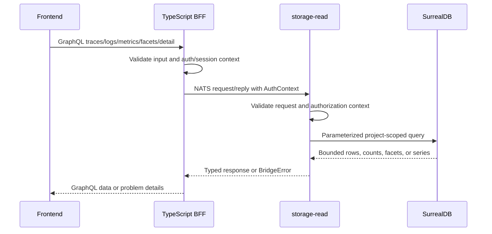

# Read Flow

Public telemetry reads use GraphQL through the TypeScript BFF. Storage-read owns the telemetry query semantics.

## Sequence

## BFF Responsibilities

- Validate public GraphQL input.
- Normalize auth context and selected project.
- Send request/reply messages through the bridge adapter.
- Validate decoded bridge responses.
- Map canonical bridge errors to public GraphQL problem details.

The BFF does not filter, aggregate, correlate, rank, or enrich telemetry records.

## storage-read Responsibilities

- Push supported filters, sorting, cursor predicates, grouping, counts, and bounded facets into the database adapter.
- Derive GraphQL-ready trace, log, metric, and facet view models.
- Enforce read authorization context.
- Return typed success or `BridgeError`.

## Common Read Subjects

| GraphQL surface | Private subject |
| --- | --- |
| `Query.traces` | `telemetry.traces.search` |
| `Query.trace` | `telemetry.traces.get` |
| `Query.logs` | `telemetry.logs.search` |
| `Query.metricNames` | `telemetry.metrics.names` |
| `Query.metricSeries` | `telemetry.metrics.query` |
| facets | `telemetry.facets` |

## Next Step

Use [Trace investigation](../guides/trace-investigation.md), [Logs](../guides/logs.md), or [Metrics](../guides/metrics.md) for user workflows.
