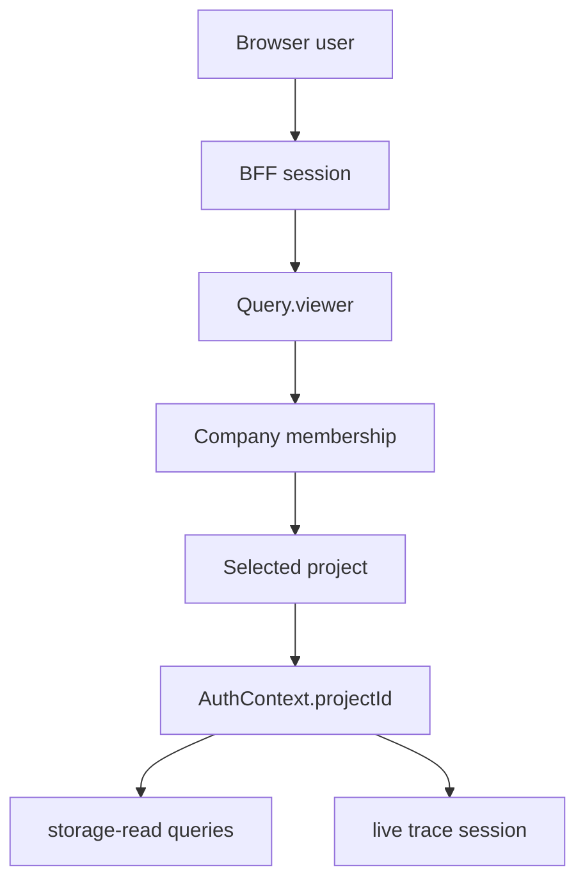

# Companies, Projects, And Access

CloudGrid has two durable ownership concepts: company and project.

## Company

A company is the administrative ownership boundary.

| Mode | Company behavior |
| --- | --- |
| Local | One visible local company named `Personal`. |
| Deployed SSO | A configured company boundary selected by `CLOUDGRID_AUTH_COMPANY_ID`. |

The first SSO user in an empty deployed company becomes company `admin`. After that bootstrap, company access is invite-only.

## Project

A project is the telemetry and workspace boundary. Traces, logs, metrics, dashboards, live subscriptions, retention policies, alert rules, ingest credentials, and AI-eval records belong to exactly one project.

Project status affects reads and ingest:

| Status | Reads | Ingest |
| --- | --- | --- |
| `active` | Allowed | Allowed |
| `read_only` | Allowed | Denied |
| `disabled` | Denied | Denied |

The collector uses a project-status cache so normal ingest does not call the control plane or database on every request.

## Company Roles

| Role | Meaning |
| --- | --- |
| `admin` | Can manage company users and has implied project `admin` access for every project in the company. |
| `user` | Can see the company boundary and can receive direct project memberships, but does not administer company membership. |

A company must always keep at least one `admin`.

## Project Roles

Project-specific membership controls project access unless the user is a company `admin`.

| Role | Can do |
| --- | --- |
| `viewer` | Read traces, logs, metrics, dashboards, alert history, and project settings metadata. |
| `editor` | Viewer permissions plus non-destructive collaboration actions such as personal dashboards and annotations. |
| `admin` | Editor permissions plus project settings, ingest credentials, retention policies, alert rules, project members, and project dashboard management. |

Company `admin` implies project `admin` for every project in that company. In local mode, the `Personal` user is project `admin` for all local projects.

## Access Flow

The frontend cannot grant access by sending a project ID. The BFF validates project selection through control-plane and forwards the normalized project context to private services.

## Invitation Lifecycle

Deployed SSO mode is invite-only after bootstrap:

1. A company admin creates an invitation for a normalized email address.
2. Control-plane records the invitation and, when SMTP delivery is enabled,
   records an email outbox job.
3. A project admin may attach pending project grants to the invitation.
4. The invited person signs in through an enabled SSO provider.
5. The provider must return a matching verified email.
6. Control-plane creates a company `user` membership, applies pending project
   grants, and marks the invitation `accepted`.

Pending invitations are not active members. Pending project grants are not
active project memberships and cannot be used for telemetry access.

## Next Step

Configure local access in [Local configuration](../configuration/local/README.md), or configure deployed SSO in [SSO overview](../configuration/deployed/sso/README.md).
