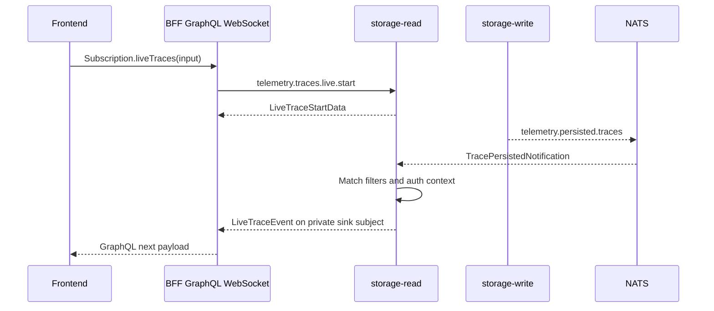

# Live Traces

Live trace receiving is a mode inside `/traces`. It is not a separate primary route.

The live path uses GraphQL subscriptions from the browser and storage-read-managed live sessions behind the BFF. The BFF never consumes ingest streams or persisted telemetry streams directly.

## How It Works

## Responsibilities

| Component | Responsibility |
| --- | --- |
| Frontend | Opens `Subscription.liveTraces`, renders live rows, owns presentation state such as selected row and pause state. |
| BFF | Manages GraphQL WebSocket lifecycle, validates input, starts/stops live sessions, watches delivery heartbeats, maps errors. |
| storage-read | Owns live filter matching, read authorization preparation, trace summary loading, sequence numbers, and fanout. |
| storage-write | Publishes trace ID notifications after successful persistence. |

## Delivery Semantics

Live notifications are at-most-once wake-up hints. They are not a second telemetry store. If a live session is disconnected, new sessions may request a bounded snapshot through storage-read query semantics, then receive new events.

The BFF closes a subscription when storage-read events or heartbeats stop arriving within the configured watchdog window. Clients may reconnect.

## Filter Changes

Changing server-side live filters starts a new GraphQL subscription operation and stops the old one. The WebSocket session may stay open. Presentation-only state can change locally without restarting the subscription.

## Safety Rules

- The frontend never opens NATS, OTLP, or SurrealDB connections.
- The BFF must not subscribe to `telemetry.ingest.*` or `telemetry.persisted.traces`.
- Storage-read owns live filtering and authorization.
- Live trace events carry trace summaries, not raw ingest payloads.

## Next Step

Use live mode after sending data with [Send telemetry](../getting-started/send-telemetry.md), or inspect the private flow in [Live trace flow](../architecture/live-trace-flow.md).
