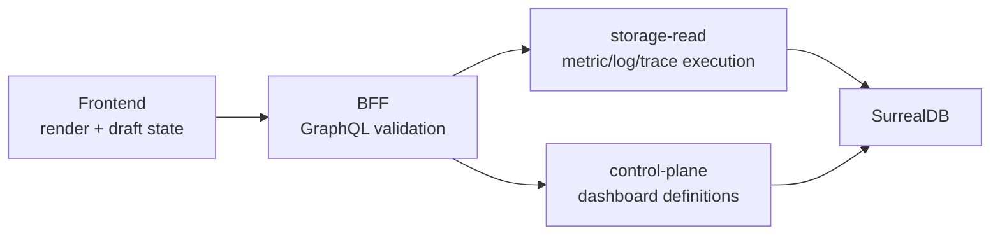

# Metrics And Dashboards

CloudGrid separates metric exploration from saved dashboard composition.

| Route | Job |
| --- | --- |
| `/metrics` | Discover metric names, inspect descriptors, query series, test aggregations, group by attributes, and inspect exemplars. |
| `/dashboards` | Build saved visual workspaces from typed metric, log, trace, and live trace widgets. |

The split is intentional. Metrics are technical telemetry evidence. Dashboards are reusable project configuration.

## Metric Explorer

The metric explorer uses:

- `Query.metricNames` for metric discovery;
- `Query.metricSeries` for ordinary series queries;
- `Query.richMetricSeries` for rich dashboard metric computations.

Storage-read owns aggregation compatibility:

| Metric kind | Supported aggregations |
| --- | --- |
| `gauge` | `avg`, `min`, `max`, `count` |
| `sum` | `sum`, `rate`, `count` |
| `histogram` | `avg`, `count`, `sum`, `p50`, `p90`, `p95`, `p99` |
| `exponential_histogram` | `avg`, `count`, `sum`, `p50`, `p90`, `p95`, `p99` |
| `summary` | `avg`, `count`, `p50`, `p90`, `p95`, `p99` when quantiles exist |

Unsupported combinations return a canonical validation error. The frontend does not calculate missing aggregations locally.

## Dashboard Workspace

Dashboards are control-plane records scoped to one project. Dashboard widgets are typed. They do not store executable code, raw SQL, raw SurrealQL, arbitrary JSON, bearer tokens, provider secrets, or external embeds.

Widget execution paths:

| Widget kind | Execution path |
| --- | --- |
| `metric_timeseries` | `Query.metricSeries` |
| `metric_stat` | `Query.metricSeries` |
| `metric_table` | `Query.metricSeries` |
| `metric_rich` | `Query.richMetricSeries` |
| `log_table` | `Query.logs` |
| `trace_table` | `Query.traces` |
| `live_trace_table` | `Subscription.liveTraces` |

Dashboard pins are user preferences returned by dashboard contracts and pin mutations. They are not browser-local shortcuts.

## Computation Boundary

The frontend may draft layout and display choices. It must not compute metric rates, percentiles, formulas, trace counts, log counts, or dashboard widget telemetry from broad raw records.

## Next Step

Use [Metrics guide](../guides/metrics.md) for exploration and [Dashboards guide](../guides/dashboards.md) for saved workspaces.
