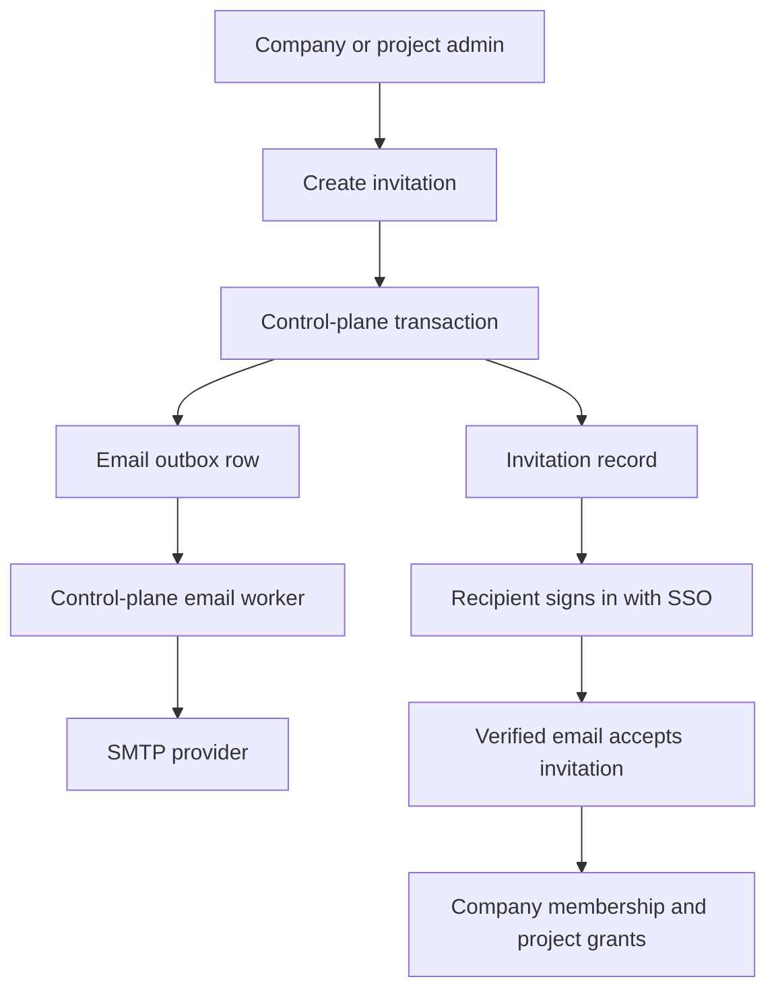

# Invitation Email Delivery

Invitation email delivery is the deployed-mode onboarding path for people who
are not already members of a CloudGrid company.

This page documents the implemented SMTP outbox path defined by
[Invitation email delivery and project onboarding](../../../specs/04-backend/invitation-email-delivery.md).
The control-plane service owns the invitation records, pending project grants,
email outbox, retry state, and SMTP worker.

## Storyline



The email does not carry a secret token. It sends the recipient to the public
CloudGrid URL. Access is granted only when the configured SSO provider returns
a matching verified email address.

## Required SMTP Shape

```sh
CLOUDGRID_PUBLIC_URL=https://cloudgrid.example.com
CLOUDGRID_INVITATION_EMAIL_MODE=smtp
CLOUDGRID_INVITATION_EMAIL_REQUIRE_DELIVERY=true
CLOUDGRID_INVITATION_EMAIL_FROM='CloudGrid <noreply@example.com>'
CLOUDGRID_INVITATION_EMAIL_REPLY_TO='platform@example.com'
CLOUDGRID_INVITATION_EMAIL_SMTP_HOST=smtp.example.com
CLOUDGRID_INVITATION_EMAIL_SMTP_PORT=587
CLOUDGRID_INVITATION_EMAIL_SMTP_TLS=starttls
CLOUDGRID_INVITATION_EMAIL_SMTP_USERNAME='<smtp-user>'
CLOUDGRID_INVITATION_EMAIL_SMTP_PASSWORD='<smtp-password>'
```

`CLOUDGRID_PUBLIC_URL` must be the browser URL where recipients sign in. It is
not the private BFF bind address and not the OTLP collector endpoint.

## Optional Delivery Tuning

```sh
CLOUDGRID_INVITATION_EMAIL_SMTP_TIMEOUT_MS=10000
CLOUDGRID_INVITATION_EMAIL_MAX_ATTEMPTS=5
CLOUDGRID_INVITATION_EMAIL_RETRY_BASE_SECONDS=60
```

Retries use exponential backoff from the durable control-plane outbox. Default
tests must use a fake SMTP transport; real-provider tests are opt-in with
`CLOUDGRID_TEST_SMTP=1`.

## Disabled Delivery

Local mode defaults to disabled delivery:

```sh
CLOUDGRID_INVITATION_EMAIL_MODE=disabled
CLOUDGRID_INVITATION_EMAIL_REQUIRE_DELIVERY=false
```

In deployed SSO mode, disabled delivery is allowed only for private operator
testing. Admin surfaces must show `suppressed` delivery status so it is clear
that the recipient needs an out-of-band notification.

## Delivery Status

| Status | Meaning |
| --- | --- |
| `not_configured` | Delivery provider is unavailable for this mode. |
| `pending` | Invitation and email job were recorded. |
| `sent` | SMTP provider accepted the message. |
| `failed_retryable` | A transient provider or network error will be retried. |
| `failed_terminal` | Retry attempts are exhausted or the provider rejected the message permanently. |
| `suppressed` | Email sending is intentionally disabled. |

Provider error text must not be exposed to users. Public surfaces show canonical
CloudGrid error codes and bounded delivery categories only.

## Project Invitations

Project invitation email follows the same delivery path as company invitations.
The difference is the pending project grant:

1. A project admin invites an email address to role `viewer`, `editor`, or
   `admin`.
2. If the email belongs to an active company member, control-plane creates or
   updates the project membership immediately.
3. If the email is not an active company member, control-plane creates or
   reuses a company invitation and attaches a pending project grant.
4. After verified SSO acceptance, control-plane creates the company membership
   and applies the project grant.

Pending project grants do not authorize telemetry reads, live subscriptions,
dashboards, ingest credential management, or settings access before acceptance.

## Failure Handling

Configuration failures block startup with `ERR-009 CONFIG_INVALID`.

Delivery failures during required enqueue or send are reported as
`ERR-022 INVITATION_EMAIL_DELIVERY_FAILED`. Provider messages are redacted from
public responses and logs must never include SMTP passwords, provider tokens,
session cookies, SurrealDB credentials, or project API keys.

## Next Step

Review [Invitations](./invitations.md) for the acceptance lifecycle, then
continue with [SSO overview](./sso/README.md).
