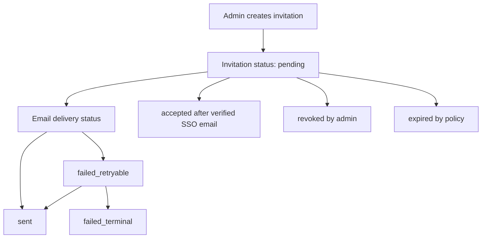
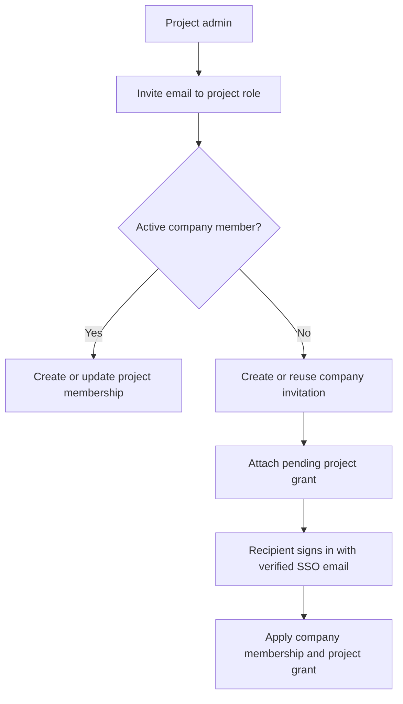

# Invitations

Deployed SSO mode is invite-only after the first company admin has been bootstrapped.

SSO authentication proves identity. Company membership still comes from control-plane rules.

This page describes the implemented invitation lifecycle across GraphQL, the
control-plane message bridge, SSO acceptance, pending project grants, and the
SMTP email outbox.

## Lifecycle

## Rules

- Only company `admin` users can create or revoke company invitations.
- Invitation email addresses are normalized by trimming whitespace and lowercasing the full address.
- At most one `pending` invitation can exist for one company and normalized email pair.
- Invitations always create company role `user` in the first version.
- Pending invitations are not active members.
- Project invitations may attach pending project grants with role `viewer`,
  `editor`, or `admin`.
- Pending project grants are not active project memberships and do not authorize
  telemetry access before the invited person accepts the invitation through SSO.
- Admin promotion is allowed only after the invited person signs in and becomes an active member.
- Revoking an accepted invitation is forbidden; remove the active member instead.

## Acceptance

During SSO callback, control-plane:

1. ensures the CloudGrid user record exists;
2. ensures the configured company exists;
3. bootstraps the first user as `admin` only when the company is empty;
4. returns existing membership when one exists;
5. otherwise finds a non-expired pending invitation whose email matches the verified provider email;
6. creates a company `user` membership;
7. applies pending project grants in the same company;
8. marks the invitation `accepted`.

Unverified or missing provider email does not accept an invitation.

## Project Onboarding

Project admins and company admins can invite an email address to a project role.

If the recipient is already an active company member, the project membership can
be created immediately. If the recipient is not a company member yet,
control-plane stores the project role as a pending grant on the invitation.

## Email Delivery

Invitation email delivery is specified as low-volume control-plane work:

- `smtp` is the first delivery adapter.
- Invitation creation writes the invitation and email outbox row in one
  transaction.
- SMTP sending is asynchronous and retried from the durable outbox.
- Mutation success means the invitation and email job were recorded; it does not
  prove the recipient read the email.
- Delivery status is visible to admins as `not_configured`, `pending`, `sent`,
  `failed_retryable`, `failed_terminal`, or `suppressed`.

Configure the delivery provider in
[Invitation email delivery](./invitation-email.md).

## Deprovisioning

The default lifecycle policy is manual. Removing a user from the upstream SSO provider does not automatically remove CloudGrid access. Admins remove members in CloudGrid.

Provider-driven deprovisioning is reserved for the explicit `sso_sync` mode
backed by trusted directory sync contracts.

## Next Step

Configure a provider in [SSO overview](./sso/README.md), then configure
[invitation email delivery](./invitation-email.md).
