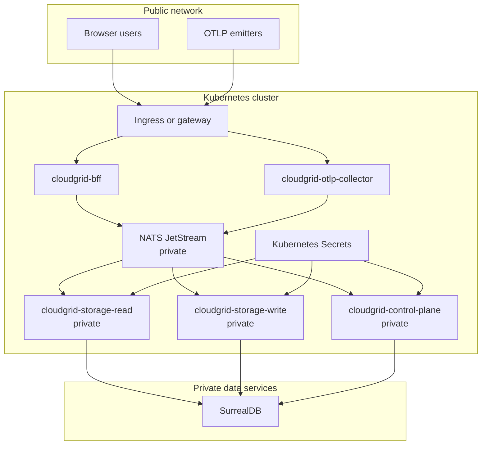

# Kubernetes And Deployment Status

CloudGrid now includes a Helm chart at `charts/cloudgrid` and a release workflow definition. Signed service images, pushed chart artifacts, SBOM/provenance output, and a release manifest are produced only when the release workflow runs.

Treat this page as a deployment-readiness map. Validate chart changes with `bun run release:validate`, `helm lint charts/cloudgrid`, and `helm template` for the local, small, and enterprise profiles before using it in an environment.

## Target Service Set

| Service | Public | Scales horizontally | Needs SurrealDB credentials |
| --- | --- | --- | --- |
| `cloudgrid-bff` | Yes | Yes | No |
| `cloudgrid-otlp-collector` | Yes | Yes | No |
| `cloudgrid-storage-read` | No | Yes | Yes |
| `cloudgrid-storage-write` | No | Production target uses pull mode for multiple replicas | Yes |
| `cloudgrid-control-plane` | No | Low-volume replicas | Yes |
| `cloudgrid-ai-eval-runner` | No | Optional | No SurrealDB access |
| `cloudgrid-alert-evaluator` | No | Optional evaluator replicas | No SurrealDB access |
| `cloudgrid-storage-maintenance` | No | Optional maintenance worker | Yes |
| NATS JetStream | No | Clustered dependency | No |
| SurrealDB | No | Deployment-specific | Owns its credentials |

## Production Deployment Boundary



## Kubernetes Boundary Rules

- Only the BFF and OTLP collector should receive ingress.
- NATS and SurrealDB must be private cluster services or external managed endpoints.
- SurrealDB credentials are mounted only into storage-read, storage-write, control-plane, and storage-maintenance pods.
- The BFF image may contain built frontend assets.
- The collector, frontend, BFF responses, and generated assets must not expose SurrealDB credentials.
- The chart must not add REST telemetry read endpoints, public NATS, or public SurrealDB.

## Helm Values Shape

The chart uses one OCI-compatible Helm artifact shape with values for:

```yaml
global:
  imageRegistry: ghcr.io/cloudgrid-dev

bff:
  replicas: 2
  image:
    repository: cloudgrid-bff
    digest: sha256:...
  env:
    CLOUDGRID_DEPLOYMENT_MODE: deployed
    CLOUDGRID_AUTH_MODE: sso

otlpCollector:
  replicas: 2
  service:
    otlpHttpPort: 4318
    otlpGrpcPort: 4317

storageRead:
  replicas: 2

storageWrite:
  replicas: 1

nats:
  external:
    url: nats://nats.private:4222

surrealdb:
  external:
    url: http://surrealdb.private:8000/rpc
    existingSecret: cloudgrid-surrealdb
```

Use this as an orientation shape. The complete, verified defaults live in `charts/cloudgrid/values.yaml`, with profile overlays under `charts/cloudgrid/profiles/`.

## Secret Handling

Kubernetes Secrets should hold:

- `CLOUDGRID_SESSION_SECRET`;
- SSO provider client secrets;
- SurrealDB username and password;
- deployed self-observability bearer token;
- optional AI-eval harness credentials when the relevant specs and adapters define them.

ConfigMaps can hold non-secret values such as deployment mode, ports, provider IDs, issuer URLs, and public callback URLs.

## Runtime Configuration Checklist

- Set `CLOUDGRID_DEPLOYMENT_MODE=deployed`.
- Set `CLOUDGRID_AUTH_MODE=sso`.
- Configure one or more SSO providers and callback URLs.
- Set `CLOUDGRID_PUBLIC_URL` to the browser URL used in invitation email links.
- Configure SMTP invitation email variables for deployed SSO onboarding.
- Keep `CLOUDGRID_GRAPHQL_UI` disabled unless the environment is trusted.
- Mount SurrealDB credentials only into storage-read, storage-write, control-plane, and storage-maintenance.
- Use external managed NATS and SurrealDB for production. Bundled chart dependencies are evaluation defaults for local and small profiles.

## Production Profiles

The release spec defines target profiles:

| Profile | Purpose |
| --- | --- |
| `local` | Single-node evaluation with bundled dependencies. |
| `small` | Team deployment with a few replicas and private dependencies. |
| `enterprise` | HPA-ready services, external NATS and SurrealDB recommended, SSO required. |

These profiles are implemented as Helm values overlays under `charts/cloudgrid/profiles/`.

## Next Step

For currently implemented runtime configuration, use [Deployed configuration](./README.md) and [SSO overview](./sso/README.md).
