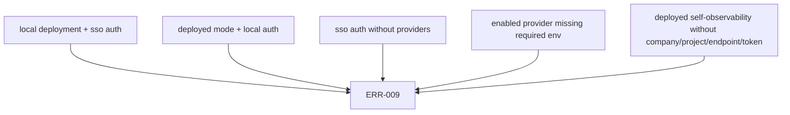

# Runtime Environment

Runtime configuration is service-owned. Each service validates only the variables it uses and fails startup with `ERR-009 CONFIG_INVALID` when required values are missing or invalid.

## Shared Variables

| Variable | Default | Purpose |
| --- | --- | --- |
| `CLOUDGRID_DEPLOYMENT_MODE` | `local` | `local` or `deployed`. Must match `CLOUDGRID_AUTH_MODE`. |
| `CLOUDGRID_AUTH_MODE` | `local` | `local` or `sso`. |
| `CLOUDGRID_NATS_URL` | `nats://localhost:4222` | Private message bridge endpoint. |
| `CLOUDGRID_STORAGE_ADAPTER` | `surrealdb` | Must match the compiled storage adapter. |

## BFF Variables

| Variable | Default | Purpose |
| --- | --- | --- |
| `CLOUDGRID_BFF_HOST` | `0.0.0.0` | BFF bind host. |
| `CLOUDGRID_BFF_PORT` | `3000` | BFF HTTP, GraphQL, auth, health, and static serving port. |
| `CLOUDGRID_GRAPHQL_MAX_DEPTH` | `12` | Maximum accepted GraphQL operation selection depth. |
| `CLOUDGRID_GRAPHQL_MAX_COMPLEXITY` | `500` | Maximum accepted GraphQL selected field count. |
| `CLOUDGRID_GRAPHQL_RESPONSE_MEDIA_TYPE` | `compatible` | GraphQL response content type mode, `compatible` or `graphql-response-json`. |
| `CLOUDGRID_FRONTEND_SERVE_STATIC` | `true` in production, otherwise `false` | Serve built frontend from the BFF. |
| `CLOUDGRID_FRONTEND_STATIC_DIR` | `./apps/backend/public` | Static frontend directory used by the BFF. |
| `CLOUDGRID_GRAPHQL_UI` | development default | Enables GraphiQL only for trusted operator sessions. |
| `CLOUDGRID_SESSION_SECRET` | unset | Required when `CLOUDGRID_AUTH_MODE=sso`. |
| `CLOUDGRID_SESSION_TTL_SECONDS` | `28800` | Browser session lifetime in seconds. |

## Collector Variables

| Variable | Default | Purpose |
| --- | --- | --- |
| `CLOUDGRID_OTLP_HTTP_ADDR` | `0.0.0.0:4318` | OTLP/HTTP bind address for traces, logs, and metrics. |
| `CLOUDGRID_OTLP_HOST` | `0.0.0.0` | Legacy host fallback when `CLOUDGRID_OTLP_HTTP_ADDR` is unset. |
| `CLOUDGRID_OTLP_PORT` | `4318` | Legacy port fallback when `CLOUDGRID_OTLP_HTTP_ADDR` is unset. |
| `CLOUDGRID_OTLP_GRPC_ADDR` | `0.0.0.0:4317` | OTLP/gRPC bind address. |
| `CLOUDGRID_OTLP_MAX_REQUEST_BYTES` | `4194304` | Maximum OTLP/HTTP request body size. |
| `CLOUDGRID_OTLP_MAX_SPANS_PER_REQUEST` | `10000` | Maximum spans accepted in one trace export. |
| `CLOUDGRID_OTLP_MAX_LOGS_PER_REQUEST` | `10000` | Maximum log records accepted in one log export. |
| `CLOUDGRID_OTLP_MAX_METRIC_POINTS_PER_REQUEST` | `20000` | Maximum metric points accepted in one metric export. |
| `CLOUDGRID_OTLP_PUBLISH_TIMEOUT_MS` | `1000` | JetStream publish acknowledgement timeout. |
| `CLOUDGRID_OTLP_GRPC_MAX_MESSAGE_BYTES` | HTTP body limit | Maximum OTLP/gRPC message size. |
| `CLOUDGRID_OTLP_GRPC_COMPRESSION` | `gzip` | OTLP/gRPC compression mode, `gzip` or `none`. |
| `CLOUDGRID_PROJECT_STATUS_CACHE_TTL_SECONDS` | `60` | Deployed-mode project status freshness window. |
| `CLOUDGRID_PROJECT_STATUS_CACHE_STALE_SECONDS` | `120` | Deployed-mode fail-closed staleness boundary. |
| `CLOUDGRID_OTLP_LOCAL_PROJECT_ID` | `default` | Local single-project fallback when token routing is not configured. |
| `CLOUDGRID_OTLP_LOCAL_PROJECT_TOKENS` | unset | JSON token-to-project map for local multi-project ingest. |

## Storage And Control-Plane Variables

| Variable | Default | Purpose |
| --- | --- | --- |
| `CLOUDGRID_SURREALDB_URL` | `http://localhost:8000/rpc` | SurrealDB RPC endpoint. |
| `CLOUDGRID_SURREALDB_NAMESPACE` | `observability` | SurrealDB namespace. |
| `CLOUDGRID_SURREALDB_DATABASE` | `dev` | SurrealDB database. |
| `CLOUDGRID_SURREALDB_USERNAME` | local `root` | Storage/control-plane credential. |
| `CLOUDGRID_SURREALDB_PASSWORD` | local `root` | Storage/control-plane credential. |
| `CLOUDGRID_STORAGE_READ_QUERY_TIMEOUT_MS` | `1500` | Query timeout applied by storage-read before SurrealDB calls. |
| `CLOUDGRID_STORAGE_READ_MAX_PAGE_SIZE` | `200` | Maximum trace/log/facet page size. |
| `CLOUDGRID_STORAGE_READ_MAX_METRIC_POINTS` | `5000` | Maximum points returned by one metric series query. |
| `CLOUDGRID_LIVE_MAX_SUBSCRIPTIONS` | `2000` | Maximum active live trace subscriptions per storage-read process. |
| `CLOUDGRID_LIVE_EVENT_BUFFER_SIZE` | `100` | Configured per-subscription live event buffer size for bounded live delivery. |

## Self-Observability Variables

| Variable | Default | Purpose |
| --- | --- | --- |
| `CLOUDGRID_SELF_OBSERVABILITY_ENABLED` | `true` in local, `false` in deployed | Enable CloudGrid service telemetry export. |
| `CLOUDGRID_SELF_OBSERVABILITY_COMPANY_ID` | `local` in local mode | Required in deployed mode when enabled. |
| `CLOUDGRID_SELF_OBSERVABILITY_PROJECT_ID` | `cloudgrid-system` | Project receiving CloudGrid service telemetry. |
| `CLOUDGRID_SELF_OBSERVABILITY_OTLP_ENDPOINT` | `http://localhost:4318` in local mode | OTLP HTTP base endpoint. |
| `CLOUDGRID_SELF_OBSERVABILITY_OTLP_BEARER_TOKEN` | unset | Required in deployed mode and in local token mode. |
| `CLOUDGRID_SELF_OBSERVABILITY_EXPORT_INTERVAL_SECONDS` | `10` | Export interval, `1..300`. |

Boolean parsing is strict for self-observability variables: use `true` or `false`, not `1` or `0`.

## Invalid Combinations

## Reference

For a lookup-only table, use [Environment variables](../reference/environment-variables.md).
