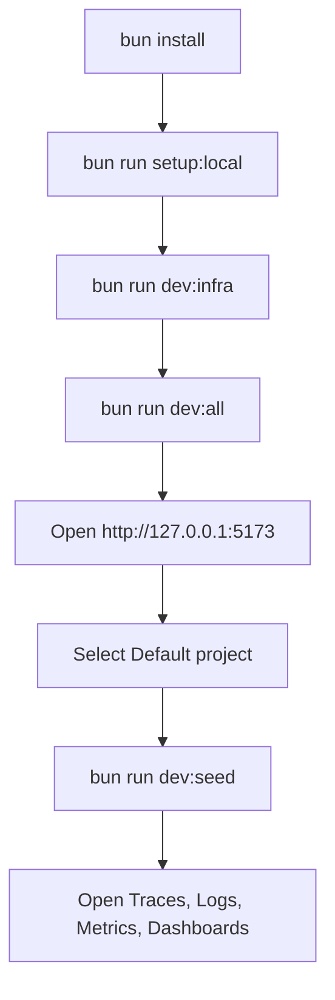

# Local Quickstart

This guide gets CloudGrid running locally with no login, a `Personal` company, an ordinary `default` project, and a `cloudgrid-system` project for CloudGrid service telemetry.

## Prerequisites

- Bun `1.3.13` or newer.
- Node-compatible tooling at Node `24.15` or newer.
- Go `1.23` or newer.
- Docker with Docker Compose.

## 1. Install Dependencies

```sh
bun install
```

## 2. Prepare Local Environment

Run the local setup command. It creates or updates `.env` with local project-token routing for `default` and `cloudgrid-system`. It does not print full token values.

```sh
bun run setup:local
```

The command writes:

- `CLOUDGRID_OTLP_LOCAL_PROJECT_TOKENS`
- `CLOUDGRID_OTLP_LOCAL_PROJECT_ID=default`
- `CLOUDGRID_PROJECT_API_KEY` for local fixture scripts
- `CLOUDGRID_SELF_OBSERVABILITY_PROJECT_ID=cloudgrid-system`
- `CLOUDGRID_SELF_OBSERVABILITY_COMPANY_ID=local`
- `CLOUDGRID_SELF_OBSERVABILITY_OTLP_BEARER_TOKEN`

## 3. Start NATS And SurrealDB

```sh
bun run dev:infra
```

Equivalent Docker Compose command:

```sh
docker compose --env-file .env up -d nats surrealdb
```

Default infrastructure endpoints:

| Component | Endpoint |
| --- | --- |
| NATS | `nats://localhost:4222` |
| NATS monitor | `http://localhost:8222` |
| SurrealDB RPC | `http://localhost:8000/rpc` |

## 4. Start CloudGrid Services

```sh
bun run dev:all
```

`dev:all` checks required ports and starts the Go services, TypeScript BFF, and Vite frontend. It expects NATS and SurrealDB to already be running.

Manual startup order, if separate terminals are useful:

```sh
go run -tags surrealdb ./core/storage-write/cmd/storage-write
go run -tags surrealdb ./core/storage-read/cmd/storage-read
go run ./core/control-plane/cmd/control-plane
bun run dev
go run ./core/otlp-collector/cmd/otlp-collector
```

Open the frontend at `http://127.0.0.1:5173/`.

GraphiQL is available at `http://localhost:3000/graphql` in development.

## 5. Select A Project

The UI opens to project selection when no project is selected. Pick `Default project` for application telemetry, or `CloudGrid` to inspect CloudGrid service telemetry when self-observability is enabled.

Project-scoped routes such as `/traces`, `/logs`, `/metrics`, `/dashboards`, and `/ai-eval` require a selected project.

## 6. Seed Development Telemetry

```sh
bun run dev:seed
```

The seed script sends generated current-time telemetry through the real collector and storage pipeline. It includes multi-service traces, related logs, and metrics.

For a continuous live trace stream:

```sh
bun run dev:seed:live
```

## First-Run Flow



## Stop Or Reset

Stop application services with `Ctrl+C` in the `dev:all` terminal.

Stop infrastructure:

```sh
docker compose --env-file .env down
```

Remove local NATS JetStream and SurrealDB data:

```sh
docker compose --env-file .env down -v
```

## Next Step

Send your own data with [Send telemetry](./send-telemetry.md), or learn how local tokens work in [Local project-token routing](../configuration/local/project-token-routing.md).
