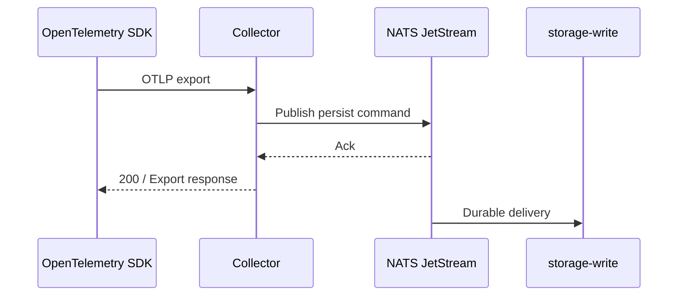

# Ingest OTLP

CloudGrid receives telemetry through standard OpenTelemetry Protocol endpoints. Use your existing OpenTelemetry SDK or collector.

## Endpoint Matrix

| Signal | HTTP endpoint | HTTP encodings | gRPC port |
| --- | --- | --- | --- |
| Traces | `/v1/traces` | JSON, protobuf | `4317` |
| Logs | `/v1/logs` | JSON, protobuf | `4317` |
| Metrics | `/v1/metrics` | JSON, protobuf | `4317` |

The HTTP collector listens on `CLOUDGRID_OTLP_HTTP_ADDR`, default `0.0.0.0:4318`. The gRPC collector listens on `CLOUDGRID_OTLP_GRPC_ADDR`, default `0.0.0.0:4317`.

## Local Development

After [Local quickstart](../getting-started/local-quickstart.md):

```sh
export OTEL_EXPORTER_OTLP_ENDPOINT=http://localhost:4318
export OTEL_EXPORTER_OTLP_PROTOCOL=http/protobuf
export CLOUDGRID_PROJECT_API_KEY='<token-from-.env>'
```

When using the checked-in seed script:

```sh
bun run dev:seed
bun run dev:seed:live
```

## Deployed Machine Ingest

In deployed mode, machine callers use project credentials. A project can have multiple active keys for different services or environments.

```sh
export OTEL_EXPORTER_OTLP_ENDPOINT=https://otlp.cloudgrid.example.com
export CLOUDGRID_PROJECT_API_KEY='cgk_...'
```

Send the key as a bearer credential:

```text
Authorization: Bearer <project-api-key>
```

The collector validates ingest authorization before reading, decoding, normalizing, or publishing the OTLP body, except for method, content-type, and request-size checks.

## Project Routing

Project routing is auth-derived:

- local single-project fallback uses `CLOUDGRID_OTLP_LOCAL_PROJECT_ID`;
- local multi-project routing uses `CLOUDGRID_OTLP_LOCAL_PROJECT_TOKENS`;
- deployed machine ingest uses project API keys or trusted bearer JWTs.

CloudGrid ignores tenant/project-like OTLP attributes for ownership. Do not route by setting resource attributes such as `projectId`, `cloudgrid.project_id`, or `tenant_id`.

## Successful Response

The collector returns after JetStream publish acknowledgement:



Database persistence happens after the HTTP/gRPC response. The UI sees data after `storage-write` persists it and `storage-read` can query it.

## Common Problems

| Symptom | Check |
| --- | --- |
| HTTP `415` or `ERR-002` | Content type must be `application/json` or `application/x-protobuf`. |
| `ERR-015` in local token mode | Missing bearer token. |
| `ERR-016` in local token mode | Unknown token or token mapped to another project. |
| Data does not appear | Confirm selected project, storage-write readiness, storage-read readiness, and time range. |
| gRPC exporter fails | Confirm `OTEL_EXPORTER_OTLP_PROTOCOL=grpc` and endpoint uses port `4317`. |

## Next Step

Create deployable project credentials with [Project API keys](./project-api-keys.md).
