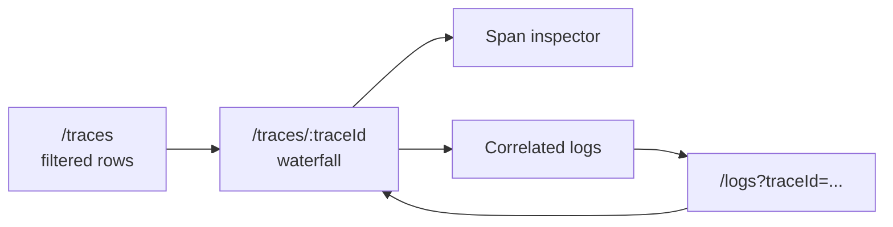

# Trace Investigation

Use `/traces` to find traces and `/traces/:traceId` to inspect one trace in depth.

## Trace Search

The trace workspace has two modes:

| Mode | Backing operation | Purpose |
| --- | --- | --- |
| History | `Query.traces` and `Query.telemetryFacets` | Search persisted traces. |
| Live | `Subscription.liveTraces` | Watch new trace summaries as they are persisted. |

Live is a mode inside `/traces`; there is no separate `/live` route.

## Search Workflow

1. Select a project.
2. Open `/traces`.
3. Choose History or Live.
4. Filter by time range, service, status, duration, free text, or advanced attribute filters.
5. Open a trace row.
6. Inspect spans, events, exceptions, links, and correlated logs.

## Trace Detail

Trace detail is a route-level workspace, not a drawer. It is designed for dense investigation state:

- selected span;
- waterfall expansion;
- span inspector tab;
- logs scope;
- URL state;
- back navigation to the filtered trace list.

## What The Frontend May Do

The frontend may keep presentation state:

- selected row or span;
- expanded tree rows;
- focused controls;
- route query parameters;
- virtualization window;
- inspector open state.

It must not compute query semantics, trace structure, service breakdowns, counts, rankings, or correlations from broad raw datasets. Storage-read returns the view model.

## Common States

| State | Expected behavior |
| --- | --- |
| No telemetry | Show setup action for OTLP ingest. |
| No filter results | Keep active chips visible and offer clear filters. |
| Storage unavailable | Show an inline problem panel with retry and problem code. |
| Missing trace | Show missing state and keep copied reference actions. |
| Live connection stalls | BFF closes the subscription with a canonical bridge timeout error. |

## Next Step

Use [Logs](./logs.md) for trace-to-log pivots and [Live traces](../concepts/live-traces.md) for realtime behavior.
