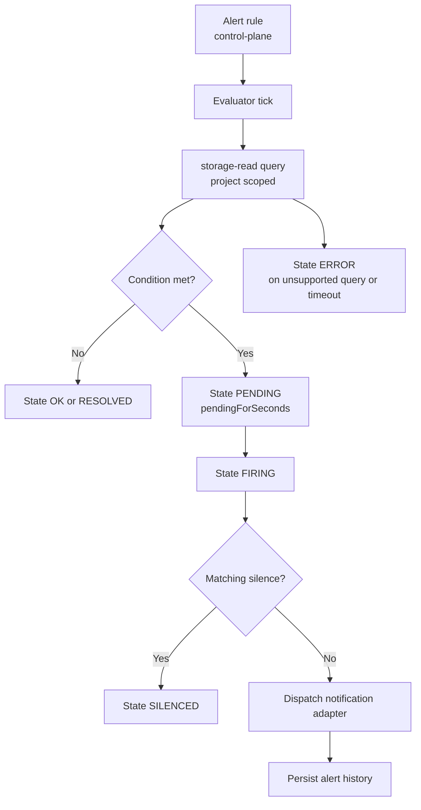

# Alerting Operations

CloudGrid alerting is project-scoped. Alert rule, silence, and history CRUD is implemented through GraphQL, the BFF bridge, control-plane storage, and the alert management UI. Rule execution belongs to a dedicated alert evaluator.

## Current Product Status

CloudGrid exposes alert management surfaces:

- alert rule configuration;
- alert silences;
- in-app alert history;
- typed rule shapes over metrics, logs, and traces.

The alert evaluator is the component that executes rules, transitions states, and dispatches notifications. The repository includes evaluator domain logic, transport-neutral handlers, and service image/chart shape. Production scheduling, live storage-read/control-plane adapters, and non-core notification adapters remain explicit follow-on work.

## Rule Kinds

| Signal | Kinds |
| --- | --- |
| Metrics | `METRIC_THRESHOLD`, `METRIC_ABSENCE` |
| Logs | `LOG_MATCH`, `LOG_COUNT` |
| Traces | `TRACE_MATCH`, `TRACE_COUNT`, `TRACE_LATENCY`, `TRACE_ERROR` |

## Evaluation Lifecycle

## Notification Adapters

The core reference adapter is in-app alert history. Non-core adapters such as email, webhook, Slack, or Teams require separate provider configuration and secret-handling specs before implementation.

Do not add notification provider secrets to dashboard widgets, frontend state, BFF responses, or alert summaries.

## Operator Checks

When the evaluator is present, check:

- evaluator schedule/tick logs;
- rule execution duration and errors;
- storage-read query failures;
- notification delivery status;
- alert history persistence;
- silence matching.

Do not document email, webhook, Slack, or Teams alert notifications as available until their provider configuration and secret-handling specs and adapters exist. Invitation email SMTP is a separate onboarding path and is not an alert notification adapter.

## Dashboard Thresholds

Dashboard widget thresholds are visual dashboard settings. They do not create alert rules and do not execute alert logic.

## Next Step

For alert concepts, read [Retention and alerts](../concepts/retention-alerts.md).
