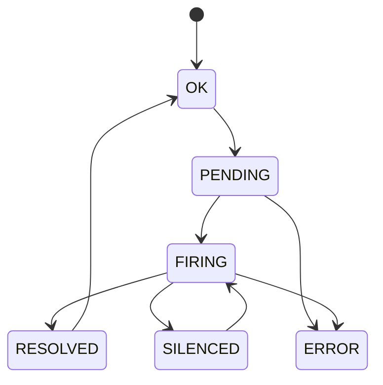

# Alerting Operations

CloudGrid alerting is project-scoped. Rules, silences, and in-app alert history are control-plane records. Rule execution belongs to a dedicated alert evaluator.

## Current Product Boundary

CloudGrid exposes alerting foundations:

- alert rule configuration;
- alert silences;
- in-app alert history;
- typed rule shapes over metrics, logs, and traces.

The alert evaluator is the component that executes rules, transitions states, and dispatches notifications. If the evaluator is not running, configured rules remain stored but do not fire.

## Rule Kinds

| Signal | Kinds |
| --- | --- |
| Metrics | `METRIC_THRESHOLD`, `METRIC_ABSENCE` |
| Logs | `LOG_MATCH`, `LOG_COUNT` |
| Traces | `TRACE_MATCH`, `TRACE_COUNT`, `TRACE_LATENCY`, `TRACE_ERROR` |

## State Flow

## Notification Adapters

The core reference adapter is in-app alert history. Non-core adapters such as email, webhook, Slack, or Teams require separate provider configuration and secret-handling specs before implementation.

Do not add notification provider secrets to dashboard widgets, frontend state, BFF responses, or alert summaries.

## Operator Checks

When the evaluator is implemented and running, check:

- evaluator schedule/tick logs;
- rule execution duration and errors;
- storage-read query failures;
- notification delivery status;
- alert history persistence;
- silence matching.

## Dashboard Thresholds

Dashboard widget thresholds are visual dashboard settings. They do not create alert rules and do not execute alert logic.

## Next Step

For alert concepts, read [Retention and alerts](../concepts/retention-alerts.md).
