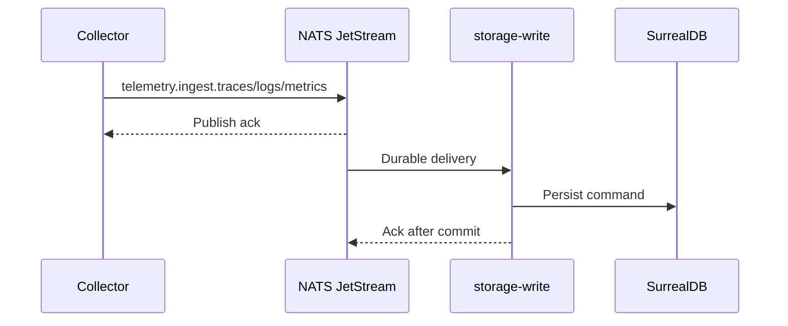

# Message Bridge Operations

CloudGrid uses NATS as the v1 private message bridge. Public clients never connect to NATS.

## What Uses NATS

| Path | NATS usage |
| --- | --- |
| OTLP ingest | Collector publishes durable ingest commands to JetStream. |
| Telemetry reads | BFF sends request/reply messages to storage-read. |
| Control-plane reads/writes | BFF sends request/reply messages to control-plane. |
| Live traces | BFF registers live sessions with storage-read; storage-read emits events to private sink subjects. |
| Post-persist trace hints | storage-write publishes volatile trace ID notifications for storage-read live fanout. |

## Local NATS Monitor

NATS monitor defaults to:

```text
http://localhost:8222
```

Useful checks:

- stream and consumer presence for telemetry ingest;
- pending JetStream messages for storage-write;
- redelivery counts and max-delivery advisories;
- request/reply timeout spikes in BFF logs.

## Ingest Stream Behavior



Storage-write acknowledges messages only after persistence succeeds. Repeated redelivery usually means SurrealDB is unavailable, schema readiness failed, or the message violates validation.

## Request/Reply Behavior

GraphQL reads use request/reply. Default timeout is 2 seconds for BFF-to-bridge calls.

Common subjects include:

- `telemetry.traces.search`
- `telemetry.traces.get`
- `telemetry.logs.search`
- `telemetry.metrics.names`
- `telemetry.metrics.query`
- `telemetry.facets`
- `control.viewer.get`
- `control.projects.list`
- `control.dashboards.list`

Timeouts map to canonical message bridge errors and then to public GraphQL problem details.

## Safety Rules

- The BFF must not consume `telemetry.ingest.*`.
- The BFF must not consume `telemetry.persisted.traces`.
- Storage-write post-persist notifications contain trace IDs and non-sensitive routing hints only.
- NATS messages must not carry SurrealDB credentials or raw provider tokens.

## Next Step

Use [Troubleshooting](./troubleshooting.md) for common bridge symptoms.
