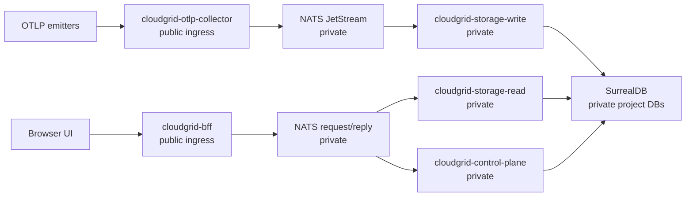
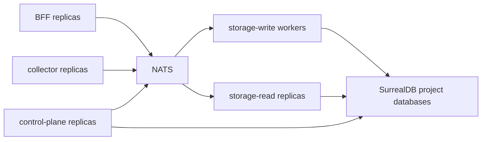

# Production Readiness

CloudGrid has implemented the main product surfaces for local and deployed-mode evaluation, but the repository still separates those surfaces from production distribution and execution gaps. Treat this page as the operator readiness map before exposing a shared CloudGrid environment.

## Implemented Surfaces

The current implementation readiness file and repository artifacts show these user-visible surfaces as implemented:

- OTLP trace, log, and metric ingest over HTTP and gRPC;
- metric query, metric explorer, and dashboard widget surfaces;
- live trace subscriptions through GraphQL, the BFF, storage-read live sessions, and storage-write post-persist notifications;
- company, project, membership, invitation, and SMTP invitation email control-plane flows;
- project retention policy CRUD in contracts, control-plane, BFF GraphQL, and project settings UI;
- project alert rule, silence, and history CRUD in contracts, control-plane, BFF GraphQL, and alert management UI;
- local Docker Compose infrastructure for NATS and SurrealDB;
- Helm chart and release workflow definitions with static release-artifact validation;
- root verification scripts and GitHub Actions verification for pull requests and pushes to `main`.

## Open Production Gaps

Do not present CloudGrid as a complete public production distribution until these gaps are closed by visible repository artifacts:

| Area | Current status |
| --- | --- |
| Release artifacts | Release workflow and Dockerfiles are present; signed images, image provenance, release manifest, SBOM output, and vulnerability reports are produced when the release workflow runs. |
| Kubernetes | Helm chart and profile overlays are present; operators still need environment-specific values, secrets, ingress/TLS, and published image digests. |
| Retention execution | Retention policy CRUD, storage-maintenance batch execution, and disabled-by-default scheduling are present; production SurrealDB deletion adapter wiring and environment-specific enablement remain before telemetry is deleted. |
| Alert execution | Alert rule/silence/history CRUD and evaluator domain logic are present; production scheduling, live service adapters, and non-core notification dispatch adapters still need environment wiring. |
| Production scale | The performance and scaling spec defines targets and variables; opt-in local and production-like benchmark scripts are present, but each deployment still needs its own recorded benchmark run before being declared production-ready. |
| Auth hardening | Local/default project isolation is implemented; production multi-tenant hardening remains a stated follow-on gap. |

## Deployment Boundary

Only the BFF and OTLP collector are public ingress candidates. NATS and SurrealDB stay private. SurrealDB credentials belong only in storage-read, storage-write, control-plane, and storage-maintenance service environments.

## Production Boundary Checklist

- Use `CLOUDGRID_DEPLOYMENT_MODE=deployed` and `CLOUDGRID_AUTH_MODE=sso`.
- Configure a real SSO provider and a strong `CLOUDGRID_SESSION_SECRET`.
- Configure SMTP invitation delivery for deployed SSO onboarding, or explicitly set disabled delivery with manual recipient notification.
- Keep project API keys in a secret manager and send them only as bearer credentials from emitters.
- Keep GraphiQL disabled except during trusted operator sessions.
- Keep local mode off untrusted networks.
- Use self-observability as a normal CloudGrid project with a normal ingest credential.
- Run the relevant root verification commands before deployment; see [Commands](../reference/commands.md).

## Scaling Shape

The intended scale path is horizontal at service boundaries. Production-scale storage-write uses pull-consumer semantics once implemented and configured. Do not introduce alternate queues, public realtime protocols, frontend direct storage access, REST telemetry reads, or BFF telemetry aggregation.

## Next Step

Review [Kubernetes and deployment status](../configuration/deployed/kubernetes.md), then use [Retention operations](./retention.md) and [Alerting operations](./alerting.md) to understand which administrative surfaces are configured versus executed.
