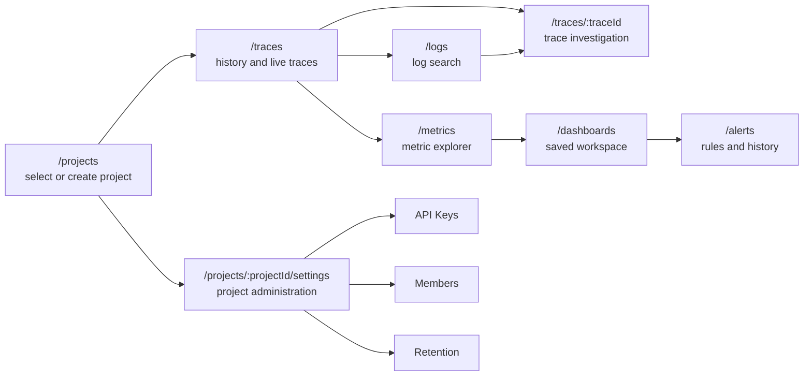

# Product Tour

CloudGrid is organized around one selected project. A project is the boundary for telemetry, dashboards, live subscriptions, alert rules, retention policy, and AI evaluation data.

## Route Storyline

## Primary Surfaces

| Surface | Purpose |
| --- | --- |
| `/projects` | Select or create the project where telemetry belongs. |
| `/traces` | Search historical traces or switch to live trace receiving. |
| `/traces/:traceId` | Inspect waterfall, spans, events, exceptions, links, and correlated logs. |
| `/logs` | Search project logs and pivot to same-project traces or spans. |
| `/metrics` | Discover metric names, inspect descriptors, query series, and review exemplars. |
| `/dashboards` | Build saved metric, log, trace, and live trace dashboards. |
| `/alerts` | Configure project alert rules, silences, and in-app alert history foundations. |
| `/ai-eval` | Optional AI evaluation workspace when `CLOUDGRID_AI_EVAL_ENABLED=true`. |

## Navigation Rules

- The global topbar is the only app-wide navigation surface.
- Project telemetry navigation appears only after a project is selected.
- The left project sidebar orders telemetry work as Traces, Logs, Metrics, Dashboards, AI Eval when enabled, then Project settings.
- Live trace receiving is a mode inside `/traces`, not a separate primary route.
- `/metrics` is the technical metric explorer. `/dashboards` is the saved dashboard workspace.

## Next Step

Run CloudGrid with [Local quickstart](../getting-started/local-quickstart.md), then send data with [Send telemetry](../getting-started/send-telemetry.md).
