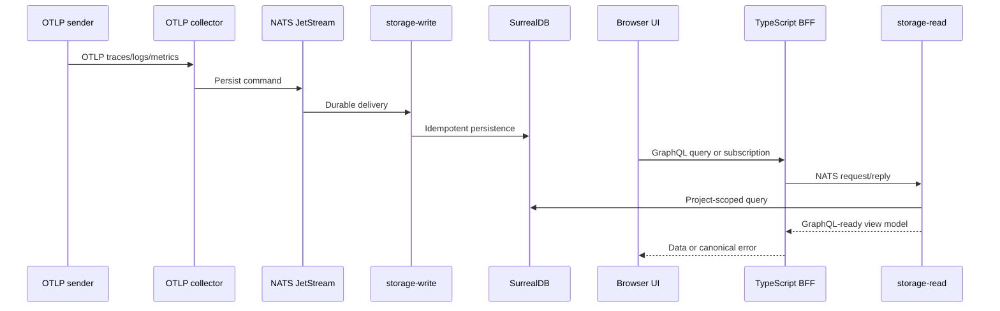

# What CloudGrid Is

CloudGrid is a focused observability application for OpenTelemetry data from services and AI-agent workloads. It receives OTLP traces, logs, and metrics, stores them behind private Go services, and exposes investigation workflows through a TypeScript GraphQL BFF and a React UI.

## Who It Is For

CloudGrid is for engineers who already emit OpenTelemetry and want a local or small-team workspace for debugging service and agent behavior without running a full production observability stack.

Primary users:

| User | Main job |
| --- | --- |
| Local developer | Run CloudGrid locally, create a project, send OTLP data, and inspect traces, logs, and metrics. |
| Team engineer | Select a project, investigate telemetry, pivot between evidence, and share URLs. |
| Platform admin | Manage projects, members, ingest credentials, retention policies, and alert foundations. |
| AI-agent engineer | Inspect agent runs, datasets, scorers, experiments, and AI quality signals when AI eval is enabled. |

## What CloudGrid Does Today

- Accepts OTLP/HTTP JSON and protobuf for traces, logs, and metrics on `4318`.
- Accepts OTLP/gRPC protobuf for traces, logs, and metrics on `4317`.
- Routes ingestion through NATS JetStream to `storage-write`.
- Persists telemetry in SurrealDB through private Go services.
- Reads telemetry through GraphQL queries served by the TypeScript BFF.
- Streams live trace updates through GraphQL subscriptions backed by `storage-read`.
- Manages companies, projects, memberships, ingest credentials, dashboards, retention policies, and alerting foundations through `control-plane`.
- Supports local no-login mode and deployed SSO mode.
- Supports optional AI evaluation surfaces and runner integration behind a feature flag.

## What Is Still Production-Readiness Work

The specs define the production target, but the repository does not yet ship public release artifacts such as signed service images, Helm charts, SBOM/provenance output, or Kubernetes manifests. Retention deletion execution, alert evaluator execution, and non-core notification adapters are also separate implementation work.

Do not configure CloudGrid local mode on an untrusted network. Local mode intentionally skips login.

## Core Data Flow

## Next Step

Choose a runtime mode in [Runtime modes](./runtime-modes.md), then run the local stack with [Local quickstart](../getting-started/local-quickstart.md).
