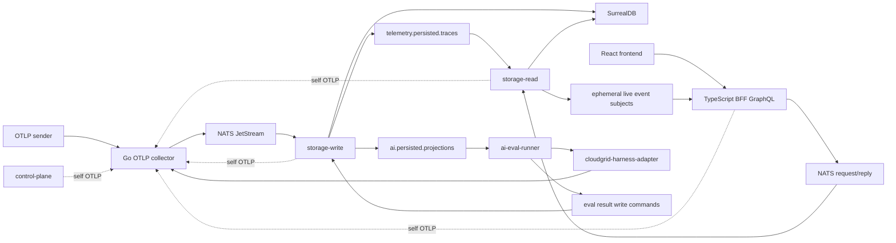

# Architecture Overview

CloudGrid is a browser-facing observability application with private ingest, storage, and read services.

## Components

- React frontend in `apps/frontend`.
- TypeScript BFF in `apps/backend`.
- Go OTLP HTTP collector in `core/otlp-collector`.
- Go storage-write service in `core/storage-write`.
- Go storage-read service in `core/storage-read`.
- Optional Go AI evaluation runner in `core/ai-eval-runner`.
- NATS request/reply and JetStream as the private message bridge.
- SurrealDB as the MVP storage adapter, reachable only from storage services.

## Data Flow

## Dependency Direction

- Frontend depends on generated UI contracts and the BFF GraphQL endpoint, including GraphQL subscriptions.
- BFF depends on UI contracts, runtime helpers, and NATS.
- Go services depend on `core/go-contracts`.
- Storage services depend on storage ports and adapter packages selected by Go build tags.
- No public component imports SurrealDB clients.

## Public API Inventory

execution_semantics: every public surface below is classified with one of the stable values required by the spec workflow.

| Surface | Kind | Audience | Stability | Owner | Contract Source | Execution Semantics | Docs |
| --- | --- | --- | --- | --- | --- | --- | --- |
| `/graphql` | API | frontend and local developers | draft | `apps/backend` | `specs/03-contracts/graphql/public-schema.graphql` | remote_service | `docs/01-getting-started/README.md` |
| `Subscription.liveTraces` | API | frontend and local developers | draft | `apps/backend` plus `core/storage-read` | `specs/03-contracts/graphql/public-schema.graphql` and `specs/03-contracts/messages/message-bridge.asyncapi.yaml` | remote_service | `docs/01-getting-started/README.md` |
| AI evaluation GraphQL operations | API | AI-agent engineers | draft | `apps/backend`, `core/storage-read`, `core/storage-write`, `core/ai-eval-runner` | `specs/03-contracts/graphql/public-schema.graphql` and `specs/01-domains/ai-eval.md` | remote_service | `docs/05-advanced/ai-eval.md` |
| `Subscription.liveExperimentRun` | API | AI-agent engineers | draft | `apps/backend` plus `core/storage-read` | `specs/03-contracts/graphql/public-schema.graphql` and `specs/02-flows/ai-eval/live-experiment-subscription.md` | remote_service | `docs/05-advanced/ai-eval.md` |
| `/v1/traces` | protocol | OTLP senders | draft | `core/otlp-collector` | `specs/03-contracts/api/http-api.openapi.yaml` | remote_service | `docs/01-getting-started/README.md` |
| `/v1/logs` | protocol | OTLP senders | draft | `core/otlp-collector` | `specs/03-contracts/api/http-api.openapi.yaml` | remote_service | `docs/01-getting-started/README.md` |
| `/v1/metrics` | protocol | OTLP senders | draft | `core/otlp-collector` | `specs/03-contracts/api/http-api.openapi.yaml` | remote_service | `docs/01-getting-started/README.md` |
| cloudgrid-harness-adapter `/v1/run`, `/v1/score`, `/v1/optimize` | protocol | `core/ai-eval-runner` maintainers | draft | `apps/packages/cloudgrid-harness-adapter` | `specs/04-backend/ai-eval-runner.md` | remote_service | `docs/05-advanced/ai-eval.md` |
| `CLOUDGRID_*` env vars | config | operators and local developers | draft | runtime services | `specs/04-backend/runtime-configuration.md` | declarative | `docs/03-operations/README.md` |
| `bun run dev:all` | CLI script | local developers | draft | `tooling/scripts/dev-all.mjs` | `package.json` | local_process | `docs/01-getting-started/README.md` |
| `bun run integration:local` | CLI script | maintainers | draft | `tooling/scripts/integration-local.mjs` | `package.json` | local_process | `docs/03-operations/README.md` |

The public API inventory intentionally exposes high-level GraphQL, GraphQL subscriptions, OTLP, config, and CLI surfaces. Low-level NATS subjects, SurrealDB schema, and adapter constructors are private escape hatches for service implementation only and are not public developer APIs.

high_level_api: public users enter through GraphQL queries/subscriptions, OTLP HTTP, environment configuration, and root scripts.

low_level_escape_hatch: NATS subjects, SurrealDB schema details, storage adapter constructors, and generated contract structs are implementation surfaces only. They are documented for maintainers but are not the default public workflow.

## Extension Points

- Storage adapters are extended by adding sibling adapter packages under each storage service and a matching Go build tag.
- UI trace investigation can add future panels without changing the private storage boundary when fields are added first to GraphQL and message contracts.
- Realtime telemetry views extend through GraphQL subscriptions first, then storage-read-owned message contracts. The BFF never becomes a telemetry stream processor.
- AI evaluation extends through optional projection, runner, and UI surfaces while preserving the same storage-read/storage-write boundaries.
- Provider profiles and production deployment manifests remain deferred. Retention policy
  CRUD and OTLP/gRPC ingest are implemented; retention deletion execution remains a
  dedicated storage-maintenance follow-on wave.
- Metrics are specified as a project-scoped OTLP signal and must preserve the same public/private boundaries as traces and logs.
- Self-observability uses the ordinary OTLP ingest path and a project-scoped UI surface. Local mode defaults to a visible fixed `CloudGrid` project in `Personal`; deployed mode requires explicit company, project, endpoint, and ingest credential configuration.
- Multi-tenant tenant/project isolation is deferred from MVP but must be designed through API, message, and persistence boundaries before production SaaS use.
