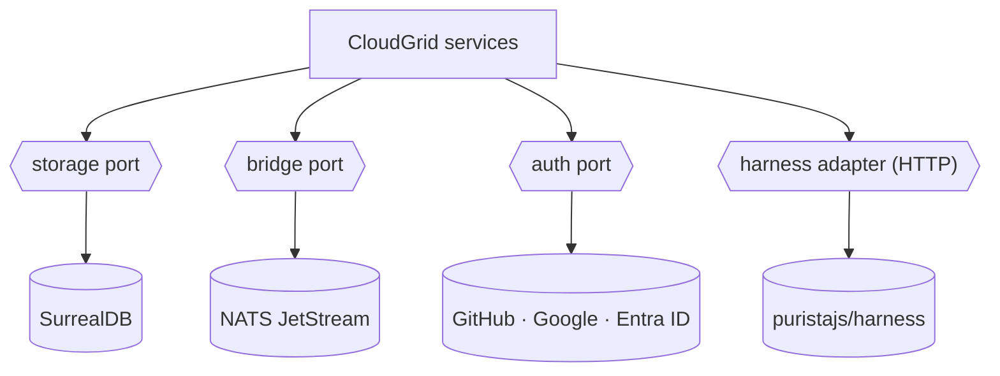

CloudGrid keeps every external dependency behind a typed port. v1 ships
with one implementation per port — swap in your own without forking the
platform.

## The four ports

| Port | v1 implementation | Adapter location |
| --- | --- | --- |
| Storage | SurrealDB | `internal/adapters/<database>/` in `storage-read` and `storage-write` |
| Message bridge | NATS JetStream | bridge-ports contract |
| Auth provider | GitHub · Google · Microsoft Entra ID | BFF-internal provider port |
| Eval harness | `puristajs/harness` | HTTP contract |

## Read more

- [Storage adapter](/handbook/adapters/storage)
- [Bridge adapter](/handbook/adapters/bridge)
- [Auth provider adapter](/handbook/adapters/auth)
- [Harness adapter](/handbook/adapters/harness)

## Contribution path

Open an issue first if you're planning a new adapter — alignment on the
port shape avoids rework. The contributor path is the same as the
maintainer path; no CLA, no rebranded community edition.
