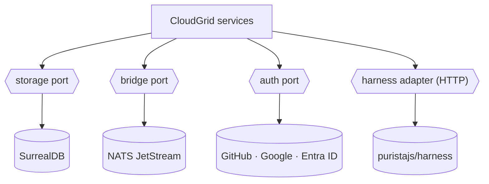

CloudGrid keeps external dependencies behind typed ports and public contracts.
Extend those ports without changing service ownership boundaries: the frontend
still talks only to the BFF, the BFF still uses message bridge contracts,
storage-write is still the only telemetry mutator, and storage-read is still the
only telemetry reader.

## Extension points

| Extension point | v1 implementation | Boundary |
| --- | --- | --- |
| Storage | SurrealDB | `internal/adapters/<database>/` in `storage-read` and `storage-write` |
| Message bridge | NATS JetStream | Bridge ports plus AsyncAPI message contracts |
| Auth provider | GitHub, Google, Microsoft Entra ID | BFF-owned browser session provider port |
| Eval harness | `puristajs/harness` | HTTP contract called by the AI evaluation runner |
| Public API clients | TypeScript helpers | Public GraphQL only |

## Read more

- [Storage adapter](/handbook/adapters/storage)
- [Bridge adapter](/handbook/adapters/bridge)
- [Auth provider adapter](/handbook/adapters/auth)
- [Harness adapter](/handbook/adapters/harness)
- [Public API clients](/handbook/adapters/public-api-clients)

## Contribution path

Start from the relevant spec and contract before writing code. If an extension
needs new fields, routes, subjects, retry behavior, or error codes, update the
source spec and machine-readable contract first.
