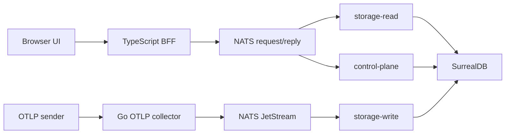

CloudGrid is split into a public BFF, public OTLP collector, private Go services, NATS, and SurrealDB. The split keeps authorization, telemetry query semantics, and database access owned by the right service.

| Topic | Page |
| --- | --- |
| Service ownership | [Service boundaries](/handbook/architecture/service-boundaries) |
| OTLP write path | [Ingest flow](/handbook/architecture/ingest-flow) |
| GraphQL read path | [Read flow](/handbook/architecture/read-flow) |
| GraphQL live subscriptions | [Live trace flow](/handbook/architecture/live-trace-flow) |
| Tenant, project, and secret boundaries | [Tenancy and security](/handbook/architecture/tenancy-security) |

## At A Glance

## Boundary Summary

- Frontend talks only to the TypeScript BFF.
- Public telemetry reads use GraphQL.
- The BFF talks to private services only through NATS request/reply and declared contracts.
- The collector publishes ingest commands and never writes SurrealDB directly.
- `storage-write` is the only normal telemetry mutator.
- `storage-read` is the only telemetry reader.
- `control-plane` owns companies, users, projects, memberships, dashboards, retention policies, alert records, and AI-eval project settings.
