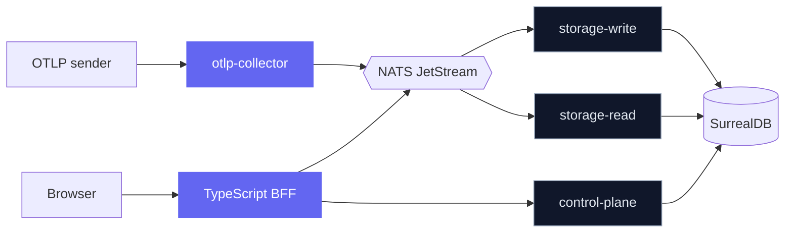

CloudGrid is a small number of single-purpose services arranged around a
message bridge. The public surface is a TypeScript backend-for-frontend;
everything sensitive is a private Go service that only the bridge can reach.

## At a glance

The browser talks only to the BFF. The BFF talks to private services through
NATS request/reply. Storage services own database access. The shape is
deliberate: every authorization decision lives in one place per
responsibility.

## Read more

- [Services](/handbook/architecture/services) — what each Go and TypeScript
  service owns, and what it must not do.
- [Message bridge](/handbook/architecture/message-bridge) — subjects,
  request/reply semantics, durable streams, and live subscription fanout.
