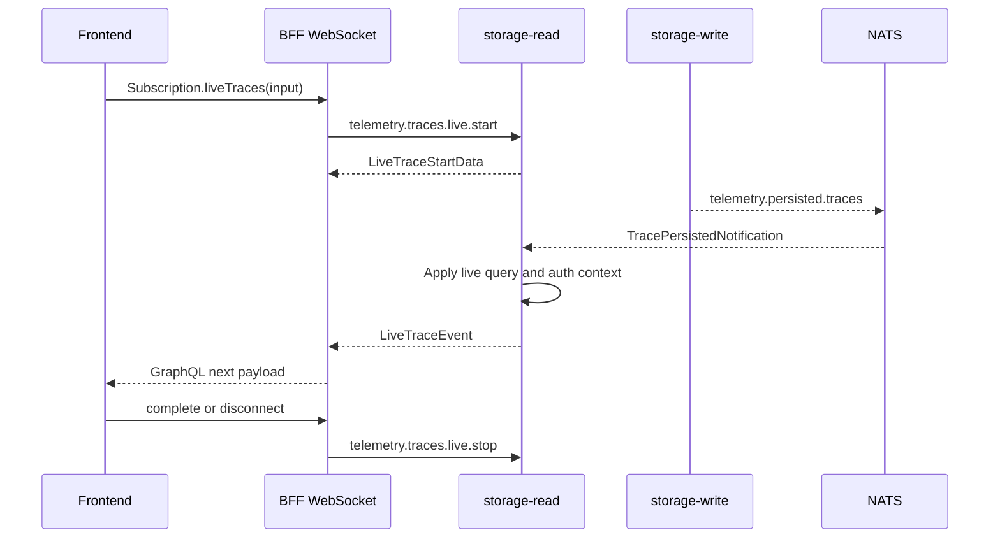

Live trace delivery uses GraphQL subscriptions and storage-read-managed live sessions.

The BFF does not consume ingest streams or persisted notification streams directly.

## Sequence

## Delivery Rules

- Live events are trace-level, not span-level.
- Delivery is at-most-once.
- Missed volatile notifications are not replayed from NATS.
- New live sessions may request bounded snapshots through storage-read.
- Per-subscription sequence numbers are owned by storage-read.
- storage-read bounds per-subscription live delivery with `CLOUDGRID_LIVE_EVENT_BUFFER_SIZE`.
- If a subscription falls behind or the delivery path stops making progress, storage-read drops that subscription with retryable `ERR-014`.

## Watchdog And Cleanup

The BFF starts a delivery watchdog after live session start. Every heartbeat, snapshot, added, or updated event resets it. If no event arrives before the watchdog deadline, the BFF closes the GraphQL subscription with a bridge timeout error and sends a stop request.

storage-read emits heartbeats every 15 seconds by default and removes sessions whose live delivery path has not made progress for 45 seconds. This cleanup is a fallback for broken BFF connections or blocked private sink delivery.

Stop requests are idempotent and must not hang WebSocket cleanup.

## Safety Rules

- The frontend opens only GraphQL subscriptions.
- The BFF must not subscribe to `telemetry.ingest.*`.
- The BFF must not subscribe to `telemetry.persisted.traces`.
- storage-read owns live filter matching and read authorization.
- storage-write notifications include only trace IDs and routing hints.

## Next Step

Read the user concept: [Live traces](/handbook/concepts/live-traces).
