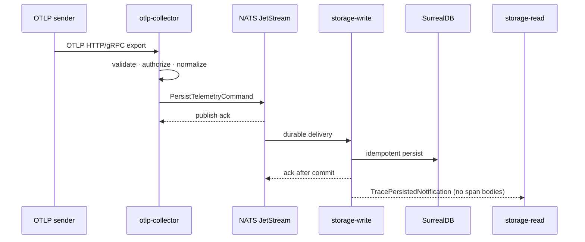
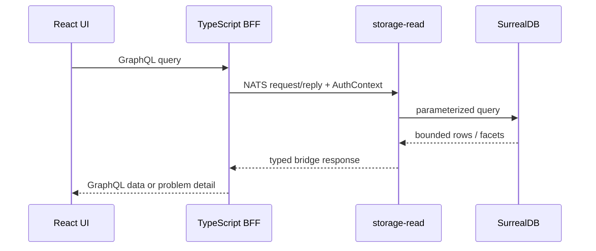

Every telemetry read and write crosses the bridge. The v1 adapter is NATS
JetStream — but the rest of CloudGrid talks to the bridge through a typed
port, so alternative transports can be implemented without touching the
services that use them.

## Subject families

Three families cover everything that flows over the bridge:

| Family | Purpose | Example subject |
| --- | --- | --- |
| `telemetry.ingest.*` | Durable streams for OTLP payloads. | `telemetry.ingest.traces` |
| `telemetry.persisted.*` | Durable post-persist notifications. | `telemetry.persisted.traces` |
| `query.*` and `live.*` | Request/reply queries and ephemeral live subjects. | `query.traces.list` |

## Ingest path

The collector returns HTTP `200` only after the bridge publish is
acknowledged. Persistence is asynchronous through the durable consumer.

## Read path

Reads are pure request/reply through the bridge. The BFF builds a
`Query.*` request, the bridge routes it to a `storage-read` instance, and
the response carries either a typed result or a `BridgeError` with a
machine-readable problem detail.

## Live trace receiving

Live subscriptions follow a slightly different shape:

1. The BFF calls `telemetry.traces.live.start` and registers an ephemeral
   sink subject.
2. `storage-read` consumes `telemetry.persisted.traces`, applies the
   subscription's filters, and publishes matching `LiveTraceEvent` messages
   to the ephemeral sink — and only to that sink.
3. When the BFF disconnects, the ephemeral subject is torn down.

The blast radius is bounded: no public service can subscribe to the durable
ingest streams directly.

## Adapter port

The bridge is a typed port, not a hard dependency. The contract covers
request/reply, durable streams, and ephemeral subject registration. A new
transport implements the port; the rest of CloudGrid is unchanged.
