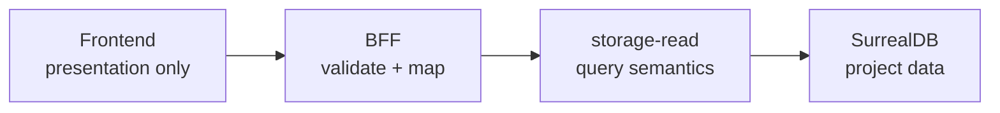

Each CloudGrid service owns one security and performance boundary.

| Service | Owns | Must not do |
| --- | --- | --- |
| `apps/backend` TypeScript BFF | Public GraphQL, GraphQL subscriptions, auth routes, health, static frontend serving, error mapping, bridge request/reply mapping | Import SurrealDB clients, consume ingest streams, aggregate telemetry, or derive telemetry view models |
| `apps/frontend` React UI | Rendering GraphQL view models and local presentation state | Call Go services, NATS, OTLP, or SurrealDB |
| `core/otlp-collector` | OTLP HTTP/gRPC ingest, ingest auth, normalization, JetStream publish | Read or write SurrealDB |
| `core/storage-write` | Durable ingest consumption and idempotent telemetry persistence | Serve public reads |
| `core/storage-read` | Trace/log/metric/facet/live query semantics and SurrealDB reads | Mutate telemetry |
| `core/control-plane` | Companies, users, memberships, invitations, invitation email outbox, projects, project status, ingest credentials, dashboards, pins, retention, alerts, AI settings | Read, write, or enrich telemetry |
| `core/ai-eval-runner` | Optional AI experiment and scoring orchestration | Import SurrealDB clients or provider credentials |

## Read Model Boundary

The frontend and BFF are intentionally dumb about telemetry:

Storage-read owns filters, sorting, cursors, counts, facets, log correlation, metric aggregation, metric grouping, metric descriptor lookup, and trace-detail view-model derivation.

## Control-Plane Boundary

Control-plane owns low-volume administrative state:

- organizations and users;
- company memberships, organization invitations, and invitation email delivery state;
- projects and project status;
- project membership records;
- ingest credential metadata and secret hashes;
- dashboards and dashboard pins;
- retention policy records;
- alert rules, silences, and in-app alert history;
- AI-eval project settings.

It must not read or enrich telemetry.

## Next Step

Follow the write path in [Ingest flow](/handbook/architecture/ingest-flow) or the read path in [Read flow](/handbook/architecture/read-flow).
