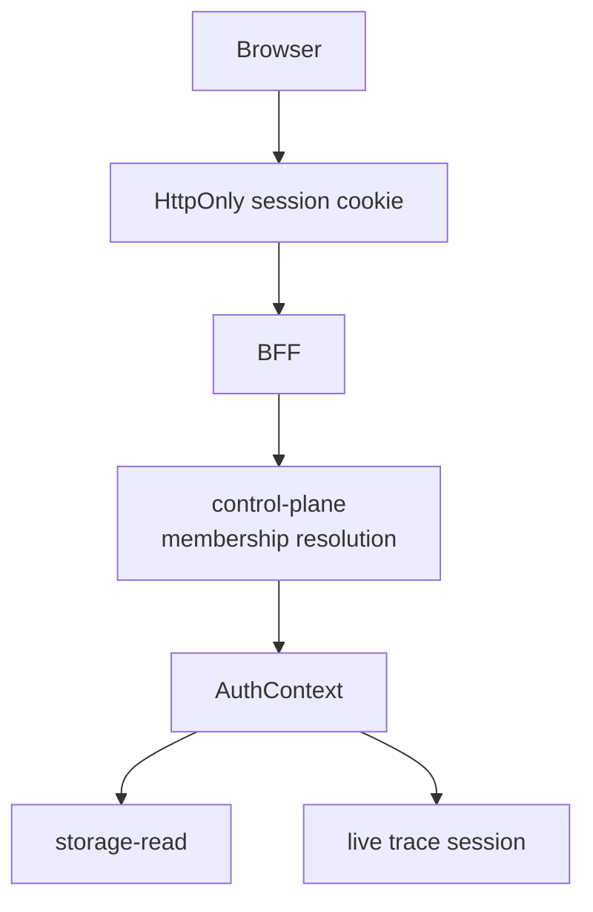
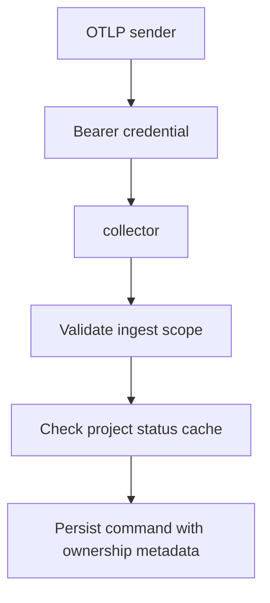

CloudGrid is designed so tenant, company, project, and secret boundaries remain enforceable at public APIs, private messages, and storage.

## Trust Sources

| Value | Trusted source |
| --- | --- |
| Browser identity | BFF session cookie or validated bearer token in deployed mode. |
| Company access | control-plane company membership. |
| Project access | control-plane project membership or company-admin fallback. |
| Ingest project | validated project API key, trusted bearer JWT, or local token mapping. |
| Telemetry ownership | normalized auth context on ingest command. |

OTLP attributes are telemetry data only. They are never trusted for tenant, company, project, principal, or permission decisions.

## Secret Boundaries

Secrets must not appear in frontend bundles, public responses, default logs, dashboards, generated assets, or telemetry attributes.

| Secret | Allowed location |
| --- | --- |
| SurrealDB username/password | storage-read, storage-write, control-plane process config. |
| SSO client secrets | BFF process config. |
| Session secret | BFF process config. |
| Project API key secret | Returned once on creation, then only one-way hash in control-plane. |
| Self-observability bearer token | service process config and collector auth path. |

## Deployed Authorization Flow

## Ingest Authorization Flow

Production ingest validation must not call control-plane or SurrealDB per request. Project status is cached by the collector and must fail closed in production when stale.

## Local Mode Warning

Local mode has no login and treats the local user as admin. Use it only on a trusted local or internal network.

## Next Step

Configure the relevant mode in [Configuration](/handbook/configuration).
