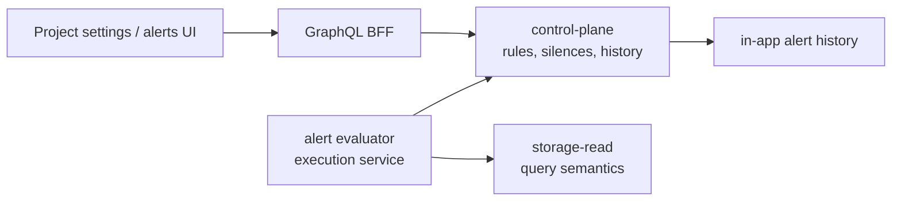

Retention and alerting are project-scoped administrative surfaces. Policy and rule management is implemented; deletion and alert execution are separate service responsibilities.

## Retention Policies

Each project has one effective retention policy with one rule per data class.

Data classes:

- `TRACES`
- `LOGS`
- `METRICS`
- `AI_EVALS`
- `DATASETS`
- `SCORERS`
- `DASHBOARD_HISTORY`
- `INGEST_CREDENTIAL_AUDIT`

Rule modes:

| Mode | Meaning |
| --- | --- |
| `retain` | Keep the data class until explicit deletion or a later saved policy changes it. |
| `delete` | Hard-delete eligible records after `retentionDays`. |
| `soft_delete_then_delete` | Hide eligible records first, then final-delete after `softDeleteDays`. |

Default policy:

| Data class | Default |
| --- | --- |
| `TRACES`, `LOGS`, `METRICS` | Delete after 30 days |
| `AI_EVALS` | Delete after 90 days |
| `DATASETS`, `SCORERS`, `DASHBOARD_HISTORY` | Retain |
| `INGEST_CREDENTIAL_AUDIT` | Delete after 365 days |

Control-plane owns retention policy records. A dedicated storage-maintenance boundary owns deletion execution. The BFF and frontend never delete telemetry for retention. The scheduler is disabled by default; production deletion requires the SurrealDB retention adapter plus explicit scheduler configuration for project IDs, batch limit, cadence, and lease duration.

## Alerting

Alerting is project-scoped. Supported rule kinds are metric, log, and trace rules:

- metric threshold and metric absence;
- log match and log count;
- trace match, trace count, trace latency, and trace error.

Supported severities:

- `INFO`
- `WARNING`
- `ERROR`
- `CRITICAL`

Supported alert states:

- `OK`
- `PENDING`
- `FIRING`
- `RESOLVED`
- `SILENCED`
- `ERROR`

## Execution Boundary

The alert evaluator owns schedules, rule execution, state transitions, deduplication, and notification dispatch. The repository includes evaluator domain logic, scheduler startup validation, service project discovery, storage-read/control-plane adapters, and the in-app, email, and webhook notification adapters. Production firing requires operators to configure the enabled adapter catalog and the deployment SMTP or webhook values. Dashboard widget thresholds are visual dashboard settings and do not execute alert rules.

Provider-specific delivery paths such as Slack, Teams, WhatsApp, SMS, PagerDuty, or a customer-owned notification gateway use the bridge-backed adapter path. Those adapters listen for alert dispatch work on the private message bridge, deliver to their provider, and return bounded delivery status. They do not evaluate rules, query telemetry, mutate alert rules, or own alert state. The signed webhook adapter remains the simplest way to connect an HTTPS receiver.

## Next Step

Operate saved policies with [Retention operations](/handbook/operations/retention) and alert management with [Alerting operations](/handbook/operations/alerting).
