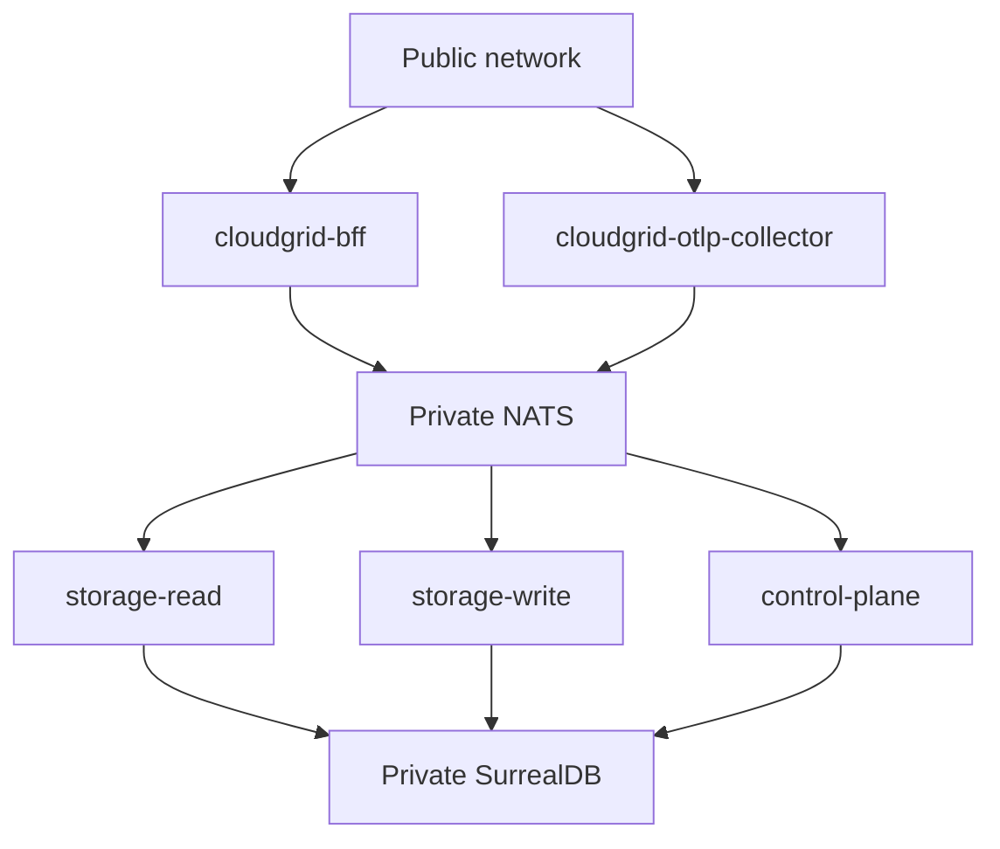

Deployed mode is the shared-user configuration for CloudGrid.

```sh
CLOUDGRID_DEPLOYMENT_MODE=deployed
CLOUDGRID_AUTH_MODE=sso
CLOUDGRID_AUTH_COMPANY_ID=acme
CLOUDGRID_AUTH_PROVIDERS=github
CLOUDGRID_SESSION_SECRET='<32-plus-byte-secret>'
```

The repository does not yet ship production release artifacts, Helm charts, or Kubernetes manifests. Use this page to understand required configuration and readiness boundaries before deploying shared environments.

## Required Decisions

| Decision | Requirement |
| --- | --- |
| Public entrypoints | BFF and OTLP collector are the only public candidates. |
| Private infrastructure | NATS and SurrealDB stay private. |
| Auth | Browser users authenticate through BFF-owned SSO. |
| Company boundary | `CLOUDGRID_AUTH_COMPANY_ID` selects the deployed company until dynamic tenant provisioning exists. |
| Invitation delivery | Email delivery uses control-plane SMTP outbox, or an explicit suppressed manual mode for private testing. |
| Ingest credentials | Machine ingest uses project API keys or trusted bearer JWTs, not browser SSO tokens. |
| Self-observability | Disabled by default; enabling it requires explicit company, project, endpoint, and bearer token. |

## Service Environment Shape



## Minimal Deployed SSO Example

```sh
CLOUDGRID_DEPLOYMENT_MODE=deployed
CLOUDGRID_AUTH_MODE=sso
CLOUDGRID_AUTH_PROVIDERS=github
CLOUDGRID_AUTH_COMPANY_ID=acme
CLOUDGRID_AUTH_GITHUB_CLIENT_ID='<client-id>'
CLOUDGRID_AUTH_GITHUB_CLIENT_SECRET='<client-secret>'
CLOUDGRID_AUTH_GITHUB_REDIRECT_URI=https://cloudgrid.example.com/auth/callback
CLOUDGRID_SESSION_SECRET='<random-session-secret>'
CLOUDGRID_PUBLIC_URL=https://cloudgrid.example.com
CLOUDGRID_INVITATION_EMAIL_MODE=smtp
CLOUDGRID_INVITATION_EMAIL_REQUIRE_DELIVERY=true
CLOUDGRID_INVITATION_EMAIL_FROM='CloudGrid <noreply@example.com>'
CLOUDGRID_INVITATION_EMAIL_SMTP_HOST=smtp.example.com
CLOUDGRID_INVITATION_EMAIL_SMTP_PORT=587
CLOUDGRID_INVITATION_EMAIL_SMTP_TLS=starttls
CLOUDGRID_NATS_URL=nats://nats.private:4222
CLOUDGRID_STORAGE_ADAPTER=surrealdb
CLOUDGRID_SURREALDB_URL=http://surrealdb.private:8000/rpc
```

SMTP invitation delivery is the normal deployed SSO onboarding path. The
control-plane writes invitation and outbox state before returning from invite
mutations, then sends and retries email asynchronously from the durable outbox.

## Production-Readiness Gaps

Before public or enterprise distribution, CloudGrid still needs:

- signed OCI images per service;
- release workflow, SBOMs, provenance, checksums, and image signing;
- Helm chart artifacts and rendered Kubernetes manifests;
- storage-maintenance retention deletion execution;
- alert evaluator scheduling/execution;
- production operational dashboards and load/capacity envelopes.

## Next Step

Configure [SSO providers](/handbook/configuration/deployed/sso), then review
[invitation email delivery](/handbook/configuration/deployed/invitation-email) and
[Kubernetes and deployment status](/handbook/configuration/deployed/kubernetes).
