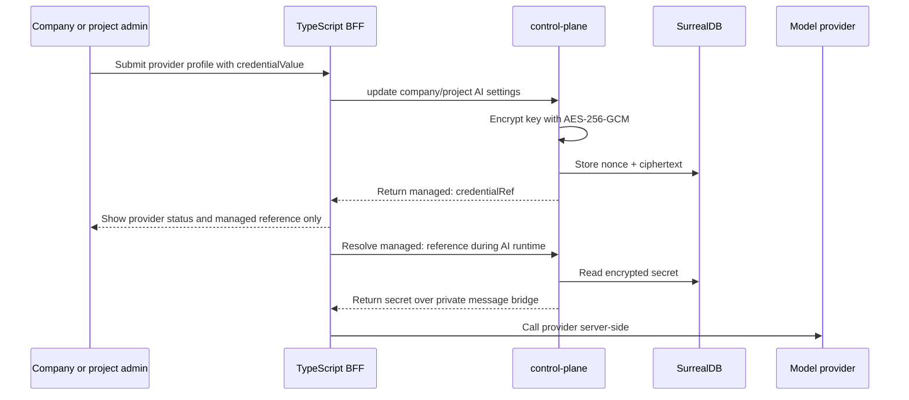

Provider secrets are the API keys CloudGrid uses when AI Chat or project AI
provider profiles call a model provider. The default deployed path is a managed
secret: an admin enters the key in CloudGrid, control-plane encrypts it, and the
runtime uses a stable `managed:` reference.

This avoids environment-variable restarts for every provider change and keeps
credentials scoped to the company or project that owns the provider profile.

## Credential Paths

| Path | Use when | Runtime behavior |
| --- | --- | --- |
| `credentialValue` | A company or project admin enters a provider API key in the UI. | Write-only input. Control-plane encrypts the value and replaces it with a `managed:` reference. |
| `managed:company/<company>/<provider>` | A company AI Chat provider was saved through CloudGrid. | BFF resolves the private reference through control-plane before calling the provider. |
| `managed:project/<project>/<provider>` | A project provider profile was saved through CloudGrid. | BFF resolves the private reference for project-scoped AI workflows. |
| `env:NAME` | Operators want one process environment variable to back a provider. | The BFF reads the local environment at runtime. Changing the value still requires process restart. |
| `external:provider/path` | A deployment integrates an external secret resolver. | The runtime adapter resolves the reference according to the deployed integration. |

## Storage Model

Managed secrets are stored in the control-plane database as encrypted
`ai_provider_secret` records.



The public GraphQL API returns provider metadata and credential references. It
does not return raw API keys. The frontend never calls model providers directly.

## Required Deployment Secret

Set a stable encryption key before accepting production provider API keys:

```sh
CLOUDGRID_PROVIDER_SECRET_ENCRYPTION_KEY='<long-random-secret>'
```

Use the same value for every control-plane replica and keep it stable across
rollouts. If the value changes, existing managed provider secrets cannot be
decrypted. Store it in the same secret-management system as SSO client secrets
and SurrealDB credentials.

Local mode may use the built-in development key. Deployed mode requires
`CLOUDGRID_PROVIDER_SECRET_ENCRYPTION_KEY` before storing or resolving managed
provider secrets.

## Operational Rules

- Mount `CLOUDGRID_PROVIDER_SECRET_ENCRYPTION_KEY` only into `control-plane`.
- Do not put provider API keys in ConfigMaps, frontend environment variables,
  browser storage, release archives, logs, support bundles, dashboard widgets,
  or generated assets.
- Rotate a provider key by opening the provider settings route and entering the
  new key. The provider profile keeps the same `managed:` reference.
- Use `env:` only for bootstrap or operator-owned providers where restart-based
  rotation is acceptable.
- Use `external:` only when the deployment has a tested secret resolver for that
  provider path.

## Routes

Company AI Chat provider:

```text
/organizations/:organizationId/ai-provider
```

Project provider profiles:

```text
/projects/:projectId/settings/ai-providers
```

Continue with [AI Chat](/handbook/guides/ai-chat) for the user workflow or
[Environment variables](/handbook/reference/environment-variables) for the full
runtime reference.
