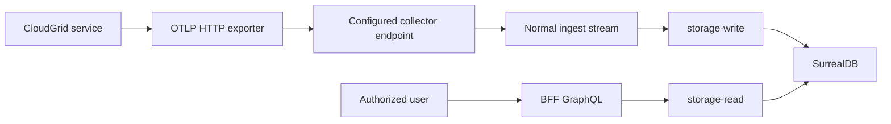

Self-observability is disabled by default in deployed mode. Enabling it requires explicit company, project, OTLP endpoint, and ingest credential configuration.

## Required Variables

```sh
CLOUDGRID_SELF_OBSERVABILITY_ENABLED=true
CLOUDGRID_SELF_OBSERVABILITY_COMPANY_ID=acme
CLOUDGRID_SELF_OBSERVABILITY_PROJECT_ID=cloudgrid-system
CLOUDGRID_SELF_OBSERVABILITY_OTLP_ENDPOINT=https://otlp.cloudgrid.example.com
CLOUDGRID_SELF_OBSERVABILITY_OTLP_BEARER_TOKEN='<project-ingest-token>'
CLOUDGRID_SELF_OBSERVABILITY_EXPORT_INTERVAL_SECONDS=10
```

Per-signal toggles:

```sh
CLOUDGRID_SELF_OBSERVABILITY_TRACES_ENABLED=true
CLOUDGRID_SELF_OBSERVABILITY_LOGS_ENABLED=true
CLOUDGRID_SELF_OBSERVABILITY_METRICS_ENABLED=true
```

## Validation

When enabled in deployed mode:

- company ID is required;
- project ID is required;
- OTLP endpoint is required;
- bearer token is required;
- control-plane readiness must validate that the configured project exists and belongs to the configured company;
- other services validate static config and rely on the collector for ingest credential authorization.

Missing or inconsistent configuration fails startup or readiness with `ERR-009 CONFIG_INVALID`.

## Access Control

Self-observability does not add hidden admin backdoors. The configured project is visible only through normal company membership and project selection.

If a user cannot select the configured project, that user cannot query its traces, logs, metrics, dashboards, live traces, alerts, or AI-eval projections.

## Export Flow



## Failure Behavior

Exporter failures log bounded warnings and never fail readiness, request handling, message acknowledgement, or shutdown. If the collector rejects self-telemetry credentials, it uses the same `ERR-016` behavior as ordinary ingest.

## Inspect CloudGrid Logs

After deployment, select the configured self-observability project and open Logs. CloudGrid service log records use the normal log query path and include bounded service, event, operation, request, and CloudGrid error attributes. When trace and span IDs are present, use the normal log-to-trace pivot to inspect the matching CloudGrid trace.

Set `CLOUDGRID_SELF_OBSERVABILITY_LOGS_ENABLED=false` when you need to stop OTLP log export without disabling stdout and stderr process logs.

## Next Step

Use [Project API keys](/handbook/guides/project-api-keys) to create the ingest credential used by `CLOUDGRID_SELF_OBSERVABILITY_OTLP_BEARER_TOKEN`.
