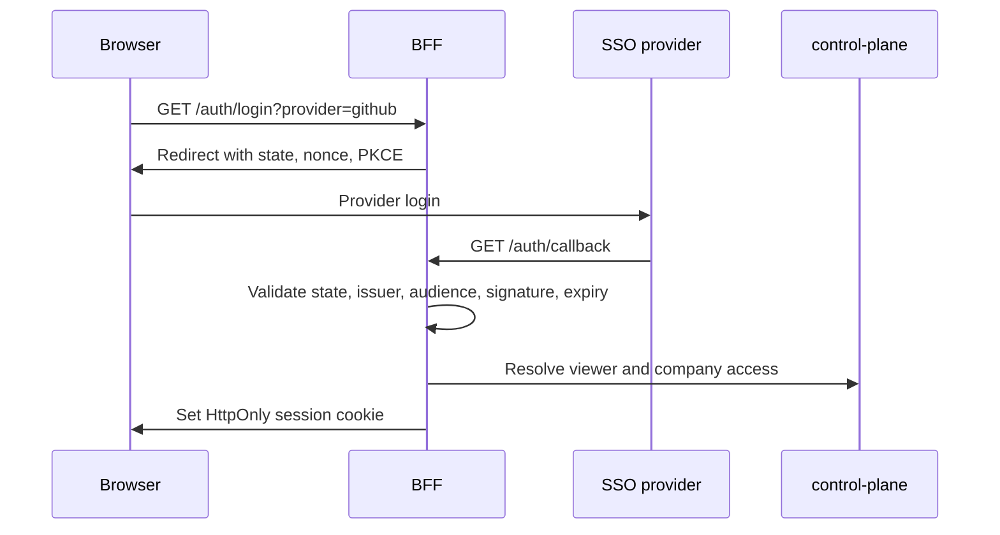

Deployed mode uses BFF-owned SSO. The frontend starts login flows but never receives provider access tokens or ID tokens.

## Supported Providers

| Provider ID | Provider | Flow |
| --- | --- | --- |
| `github` | GitHub OAuth App | OAuth web flow plus GitHub user/email APIs |
| `google` | Google | OIDC authorization code flow with PKCE |
| `azure` | Microsoft Azure Entra ID | OIDC authorization code flow with PKCE |

Enable providers with:

```sh
CLOUDGRID_AUTH_PROVIDERS=github,google,azure
```

Use any comma-separated subset.

## Browser Login Flow



## Common Variables

```sh
CLOUDGRID_DEPLOYMENT_MODE=deployed
CLOUDGRID_AUTH_MODE=sso
CLOUDGRID_AUTH_PROVIDERS=github
CLOUDGRID_AUTH_COMPANY_ID=acme
CLOUDGRID_SESSION_SECRET='<random-session-secret>'
CLOUDGRID_SESSION_TTL_SECONDS=28800
```

`CLOUDGRID_AUTH_COMPANY_ID` is the configured deployed company boundary until dynamic tenant provisioning exists.

## Provider Pages

- [GitHub SSO](/handbook/configuration/deployed/sso/github)
- [Google SSO](/handbook/configuration/deployed/sso/google)
- [Azure Entra ID SSO](/handbook/configuration/deployed/sso/azure)

## Access After Login

SSO authentication proves identity. It does not automatically grant company or project access after the first admin bootstrap.

After the first company admin exists:

1. a company admin creates an invitation for an email address;
2. a project admin may attach pending project grants for project onboarding;
3. the invitation email sends the user to the configured public CloudGrid URL;
4. the invited user signs in through an enabled provider;
5. the provider must return a matching verified email;
6. control-plane creates a company `user` membership and applies pending project
   grants.

Read [Invitations](/handbook/configuration/deployed/invitations) for the lifecycle and
[Invitation email delivery](/handbook/configuration/deployed/invitation-email) for the SMTP boundary.
