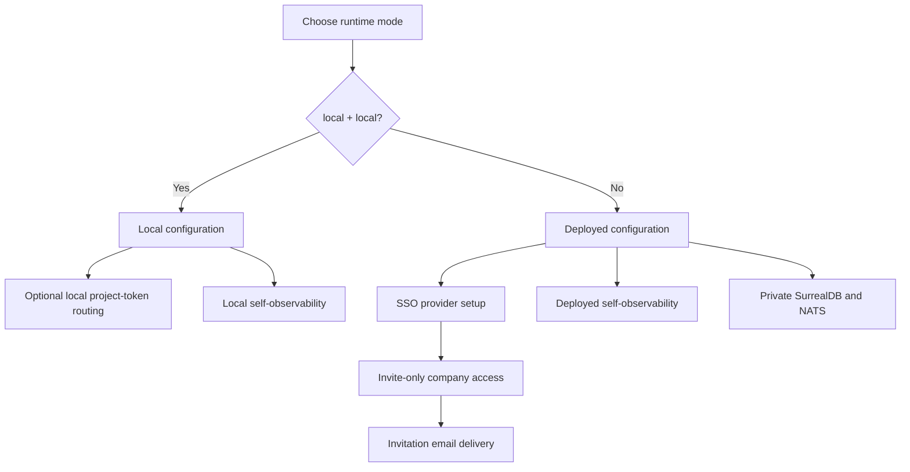

CloudGrid is configured with environment variables. Start with the smallest mode that works, then add deployed-mode hardening only when the deployment needs shared users or production boundaries.

## Configuration Storyline



## Sections

| Topic | Page |
| --- | --- |
| Runtime modes and validation | [Runtime environment](/handbook/configuration/runtime-environment) |
| Local mode setup | [Local configuration](/handbook/configuration/local) |
| Local token routing | [Local project-token routing](/handbook/configuration/local/project-token-routing) |
| Local self-observability | [Local self-observability](/handbook/configuration/local/self-observability) |
| Deployed mode setup | [Deployed configuration](/handbook/configuration/deployed) |
| Kubernetes readiness | [Kubernetes and deployment status](/handbook/configuration/deployed/kubernetes) |
| SSO provider setup | [SSO overview](/handbook/configuration/deployed/sso) |
| Organization invitations | [Invitations](/handbook/configuration/deployed/invitations) |
| Invitation email delivery | [Invitation email delivery](/handbook/configuration/deployed/invitation-email) |
| Deployed self-observability | [Deployed self-observability](/handbook/configuration/deployed/self-observability) |
| Storage | [SurrealDB storage](/handbook/configuration/storage-surrealdb) |

## Safe Defaults

Local development:

```sh
CLOUDGRID_DEPLOYMENT_MODE=local
CLOUDGRID_AUTH_MODE=local
CLOUDGRID_NATS_URL=nats://localhost:4222
CLOUDGRID_STORAGE_ADAPTER=surrealdb
CLOUDGRID_SURREALDB_URL=http://localhost:8000/rpc
```

Deployed shared mode:

```sh
CLOUDGRID_DEPLOYMENT_MODE=deployed
CLOUDGRID_AUTH_MODE=sso
CLOUDGRID_AUTH_PROVIDERS=github
CLOUDGRID_AUTH_COMPANY_ID=acme
CLOUDGRID_SESSION_SECRET='<32-plus-byte-secret>'
CLOUDGRID_PUBLIC_URL=https://cloudgrid.example.com
CLOUDGRID_INVITATION_EMAIL_MODE=smtp
CLOUDGRID_INVITATION_EMAIL_REQUIRE_DELIVERY=true
CLOUDGRID_INVITATION_EMAIL_FROM='CloudGrid <noreply@example.com>'
CLOUDGRID_INVITATION_EMAIL_SMTP_HOST=smtp.example.com
CLOUDGRID_INVITATION_EMAIL_SMTP_PORT=587
```

## Boundary Rules

- SurrealDB credentials belong only to storage and control-plane services.
- The frontend never receives SurrealDB credentials, provider tokens, session secrets, or project API key secrets.
- The BFF owns browser SSO sessions and public GraphQL.
- The collector owns OTLP ingest authorization before payload decode.
- Unknown production-scale variables must not be partially applied until their spec and tests exist.

## Next Step

For a laptop, continue with [Local configuration](/handbook/configuration/local). For shared mode, continue with [Deployed configuration](/handbook/configuration/deployed).
