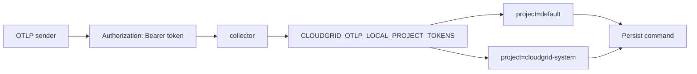

Local token routing lets one local CloudGrid instance receive telemetry for more than one project.

## Token Map

`CLOUDGRID_OTLP_LOCAL_PROJECT_TOKENS` is a JSON object whose keys are opaque bearer tokens and whose values are local project IDs.

```sh
export CLOUDGRID_OTLP_LOCAL_PROJECT_TOKENS='{
  "dev-checkout-token-000000000000000001": "default",
  "dev-cloudgrid-token-00000000000000001": "cloudgrid-system"
}'
```

Token keys must be at least 32 characters. Use `bun run setup:local` to generate real token values.

## Sender Configuration

HTTP exporters:

```sh
export OTEL_EXPORTER_OTLP_ENDPOINT=http://localhost:4318
export CLOUDGRID_PROJECT_API_KEY='<token-mapped-to-project>'
```

gRPC exporters:

```sh
export OTEL_EXPORTER_OTLP_ENDPOINT=http://localhost:4317
export OTEL_EXPORTER_OTLP_PROTOCOL=grpc
export CLOUDGRID_PROJECT_API_KEY='<token-mapped-to-project>'
```

For raw HTTP requests:

```sh
curl -sS -H 'content-type: application/json' \
  -H "authorization: Bearer ${CLOUDGRID_PROJECT_API_KEY}" \
  --data @fixtures/otlp/traces.json \
  http://localhost:4318/v1/traces
```

## Failure Behavior

When token routing is configured, the collector fails closed:

| Case | Result |
| --- | --- |
| Missing `Authorization` header | `ERR-015 AUTH_REQUIRED` |
| Unknown bearer token | `ERR-016 AUTH_FORBIDDEN` |
| Token mapped to another project | Telemetry is routed only to the mapped project. |

Token values are never logged, persisted in telemetry, copied into attributes, or returned in error bodies.

## Routing Diagram



## Single-Project Fallback

When `CLOUDGRID_OTLP_LOCAL_PROJECT_TOKENS` is empty, local ingest may use `CLOUDGRID_OTLP_LOCAL_PROJECT_ID` and otherwise falls back to `default`.

This fallback is for single-project development. It must not silently route CloudGrid self-observability to `cloudgrid-system`.
