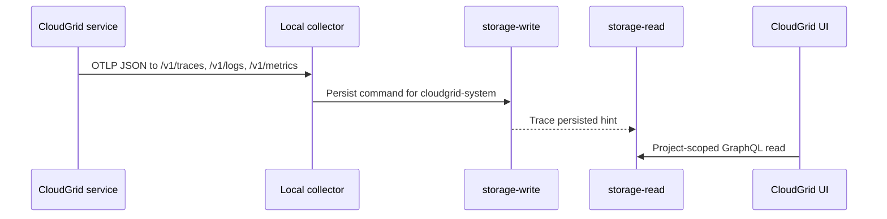

Self-observability lets CloudGrid services send their own traces, logs, and metrics through the same OTLP ingest path as application telemetry.

## Local Defaults

```sh
CLOUDGRID_SELF_OBSERVABILITY_ENABLED=true
CLOUDGRID_SELF_OBSERVABILITY_COMPANY_ID=local
CLOUDGRID_SELF_OBSERVABILITY_PROJECT_ID=cloudgrid-system
CLOUDGRID_SELF_OBSERVABILITY_OTLP_ENDPOINT=http://localhost:4318
CLOUDGRID_SELF_OBSERVABILITY_EXPORT_INTERVAL_SECONDS=10
CLOUDGRID_SELF_OBSERVABILITY_TRACES_ENABLED=true
CLOUDGRID_SELF_OBSERVABILITY_LOGS_ENABLED=true
CLOUDGRID_SELF_OBSERVABILITY_METRICS_ENABLED=true
CLOUDGRID_DB_ADAPTER_TRACING_ENABLED=false
```

When local self-observability is enabled, also set:

```sh
CLOUDGRID_SELF_OBSERVABILITY_OTLP_BEARER_TOKEN='<token-mapped-to-cloudgrid-system>'
```

`bun run setup:local` writes this value for you.

## Project Behavior

The local self-observability project:

- has ID `cloudgrid-system`;
- is named `CloudGrid`;
- belongs to the `Personal` company;
- is visible in the normal project picker;
- can be selected and queried like any other project;
- cannot be renamed or disabled in local mode.

## Export Flow



## Failure Behavior

Exporter failures log bounded warnings and do not fail readiness, request handling, message acknowledgement, or shutdown. Exporter telemetry is rate-limited to avoid recursive noise during collector outages.

## Inspect CloudGrid Logs

1. Open CloudGrid and select the `CloudGrid` project.
2. Open Logs.
3. Filter by `serviceName` or the `cloudgrid.event` attribute to focus on a service lifecycle or error event.
4. Use trace and span IDs on a log row to pivot into the matching CloudGrid trace when those IDs are present.

`CLOUDGRID_SELF_OBSERVABILITY_LOGS_ENABLED=false` disables the OTLP log export path only. Process stdout and stderr logs continue to work.

Set `CLOUDGRID_DB_ADAPTER_TRACING_ENABLED=true` only for local development diagnostics when you need child spans for regular SurrealDB adapter operations. This flag is disabled by default, has no effect without trace export, and is rejected in deployed mode.

## Safety Rules

- CloudGrid services must not emit bearer tokens, cookies, SurrealDB credentials, provider secrets, raw GraphQL documents, raw OTLP payloads, or raw SurrealQL.
- Deep database adapter spans must not include raw queries, bind parameters, result rows, provider error strings, IDs, credentials, or secret-store operations.
- Project ownership still comes from collector auth and routing, not OTLP resource attributes.
- Internal metrics use bounded labels and must not contain tenant IDs, project IDs, trace IDs, span IDs, user IDs, emails, raw paths with IDs, or raw error messages.
