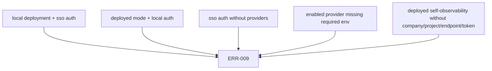

Runtime configuration is service-owned. Each service validates only the variables it uses and fails startup with `ERR-009 CONFIG_INVALID` when required values are missing or invalid.

## Shared Variables

| Variable | Default | Purpose |
| --- | --- | --- |
| `CLOUDGRID_DEPLOYMENT_MODE` | `local` | `local` or `deployed`. Must match `CLOUDGRID_AUTH_MODE`. |
| `CLOUDGRID_AUTH_MODE` | `local` | `local` or `sso`. |
| `CLOUDGRID_NATS_URL` | `nats://localhost:4222` | Private message bridge endpoint. |
| `CLOUDGRID_STORAGE_ADAPTER` | `surrealdb` | Must match the compiled storage adapter. |

## BFF Variables

| Variable | Default | Purpose |
| --- | --- | --- |
| `CLOUDGRID_BFF_HOST` | `0.0.0.0` | BFF bind host. |
| `CLOUDGRID_BFF_PORT` | `3000` | BFF HTTP, GraphQL, auth, health, and static serving port. |
| `CLOUDGRID_FRONTEND_SERVE_STATIC` | `true` in production, otherwise `false` | Serve built frontend from the BFF. |
| `CLOUDGRID_FRONTEND_STATIC_DIR` | `./apps/backend/public` | Static frontend directory used by the BFF. |
| `CLOUDGRID_SESSION_SECRET` | unset | Required when `CLOUDGRID_AUTH_MODE=sso`. |
| `CLOUDGRID_SESSION_TTL_SECONDS` | `28800` | Browser session lifetime in seconds. |

## Collector Variables

| Variable | Default | Purpose |
| --- | --- | --- |
| `CLOUDGRID_OTLP_HTTP_ADDR` | `0.0.0.0:4318` | OTLP/HTTP bind address for traces, logs, and metrics. |
| `CLOUDGRID_OTLP_GRPC_ADDR` | `0.0.0.0:4317` | OTLP/gRPC bind address. |
| `CLOUDGRID_OTLP_MAX_REQUEST_BYTES` | `4194304` | Maximum OTLP/HTTP request body size. |
| `CLOUDGRID_OTLP_GRPC_MAX_MESSAGE_BYTES` | HTTP body limit | Maximum OTLP/gRPC message size. |
| `CLOUDGRID_OTLP_GRPC_COMPRESSION` | `gzip` | OTLP/gRPC compression mode, `gzip` or `none`. |
| `CLOUDGRID_OTLP_LOCAL_PROJECT_ID` | `default` | Local single-project fallback when token routing is not configured. |
| `CLOUDGRID_OTLP_LOCAL_PROJECT_TOKENS` | unset | JSON token-to-project map for local multi-project ingest. |
| `CLOUDGRID_AUTH_ISSUER` | unset | Collector-only issuer for deployed OTLP ingest bearer tokens when `CLOUDGRID_AUTH_MODE=sso`. |
| `CLOUDGRID_AUTH_AUDIENCE` | unset | Collector-only audience for deployed OTLP ingest bearer tokens when `CLOUDGRID_AUTH_MODE=sso`. |
| `CLOUDGRID_AUTH_JWKS_URL` | unset | Collector-only JWKS endpoint for deployed OTLP ingest bearer-token validation when `CLOUDGRID_AUTH_MODE=sso`. |

## Storage And Control-Plane Variables

| Variable | Default | Purpose |
| --- | --- | --- |
| `CLOUDGRID_SURREALDB_URL` | `http://localhost:8000/rpc` | SurrealDB RPC endpoint. |
| `CLOUDGRID_SURREALDB_PORT` | `8000` | Local Docker Compose host port used to derive the local SurrealDB URL. |
| `CLOUDGRID_SURREALDB_NAMESPACE` | `observability` | SurrealDB namespace. |
| `CLOUDGRID_SURREALDB_DATABASE` | `dev` | SurrealDB database. |
| `CLOUDGRID_SURREALDB_USERNAME` | local `root` | Storage/control-plane credential. |
| `CLOUDGRID_SURREALDB_PASSWORD` | local `root` | Storage/control-plane credential. |
| `CLOUDGRID_STORAGE_READ_MAX_METRIC_POINTS` | `5000` | Maximum points returned by one metric series query. |

If another local SurrealDB already owns port `8000`, run `bun run setup:local`
to select a free `CLOUDGRID_SURREALDB_PORT` and matching
`CLOUDGRID_SURREALDB_URL` before starting Docker Compose.

## Self-Observability Variables

| Variable | Default | Purpose |
| --- | --- | --- |
| `CLOUDGRID_SELF_OBSERVABILITY_ENABLED` | `true` in local, `false` in deployed | Enable CloudGrid service telemetry export. |
| `CLOUDGRID_SELF_OBSERVABILITY_COMPANY_ID` | `local` in local mode | Required in deployed mode when enabled. |
| `CLOUDGRID_SELF_OBSERVABILITY_PROJECT_ID` | `cloudgrid-system` | Project receiving CloudGrid service telemetry. |
| `CLOUDGRID_SELF_OBSERVABILITY_OTLP_ENDPOINT` | `http://localhost:4318` in local mode | OTLP HTTP base endpoint. |
| `CLOUDGRID_SELF_OBSERVABILITY_OTLP_BEARER_TOKEN` | unset | Required whenever self-observability is enabled; in local mode it must map to `cloudgrid-system`. |
| `CLOUDGRID_SELF_OBSERVABILITY_EXPORT_INTERVAL_SECONDS` | `10` | Export interval, `1..300`. |
| `CLOUDGRID_DB_ADAPTER_TRACING_ENABLED` | `false` | Local-only database adapter child spans for development diagnostics. Deployed mode rejects `true`. |

Boolean parsing is strict for self-observability variables: use `true` or `false`, not `1` or `0`.

## Invalid Combinations

## Reference

For a lookup-only table, use [Environment variables](/handbook/reference/environment-variables).
