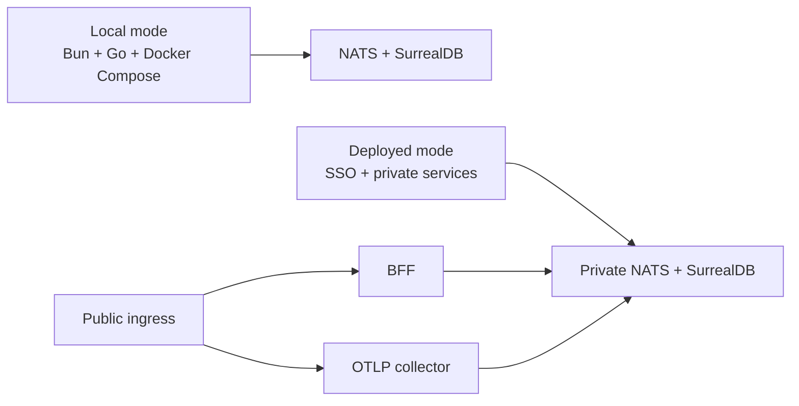

CloudGrid supports local development today and has an explicit deployed-mode target for shared SSO environments. Use this page as the public entry point for deployment status and production-readiness work.

## Runtime Shapes

## Start Here

| Goal | Read |
| --- | --- |
| Run locally | [Local quickstart](/handbook/getting-started/local-quickstart) |
| Understand runtime modes | [Runtime modes](/handbook/overview/runtime-modes) |
| Configure deployed services | [Deployed configuration](/handbook/configuration/deployed) |
| Install in Kubernetes | [Enterprise Helm install](/handbook/configuration/deployed/helm-install) |
| Verify release artifacts | [Release artifact verification](/handbook/operations/release-verification) |
| Size production deployments | [Sizing and scaling](/handbook/operations/sizing) |
| Check Kubernetes status | [Kubernetes and deployment status](/handbook/configuration/deployed/kubernetes) |
| Review production gaps | [Production readiness](/handbook/operations/production-readiness) |

The repository includes Helm chart and release workflow definitions. Signed service images, SBOM/provenance output, and release manifests are produced by the release workflow. Production deployments should install the versioned chart with image digests from the verified release artifacts, not mutable tags.
