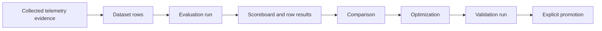

CloudGrid evaluations help teams turn known examples and trace-backed production
evidence into repeatable quality measurements for AI workflows.

The workflow is:

1. Prepare a dataset.
2. Run an evaluation against a target.
3. Inspect aggregate and per-row results.
4. Compare a baseline and candidate.
5. Optimize prompts or examples.
6. Promote the candidate that has validation evidence.

Evaluation produces metrics, results, examples, and comparisons. It does not
create a release gate by itself.

## When To Use Collected Telemetry

Use collected telemetry when the row should explain a real behavior:

- a trace shows a wrong classification;
- a span output is missing a JSON field;
- a tool call took the workflow down the wrong path;
- a model or tool sequence used too many steps;
- a production output is useful, but the correct expected output still needs
  human review.

CloudGrid keeps source links and bounded trajectory summaries with evaluation
results so the team can review evidence without copying full traces into a
dataset.

## The Evaluation Loop

## Where To Go Next

| Goal | Page |
| --- | --- |
| Create and manage reusable examples | [Datasets](/handbook/evaluations/datasets) |
| Run and inspect evaluation results | [Evaluations](/handbook/evaluations/evaluations) |
| Improve a target with evidence | [Optimizations](/handbook/evaluations/optimizations) |

Enable AI Eval in project settings before using these workflows. The AI Eval
workspace then appears in the selected-project sidebar.
