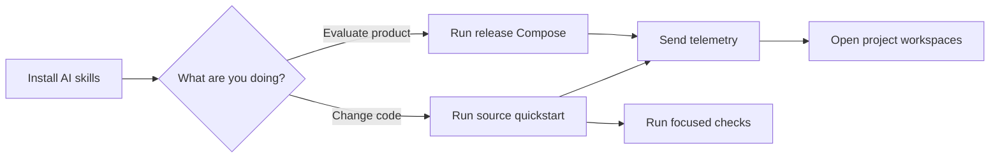

Start here when you want a working CloudGrid stack on your machine. Use release Compose when you want to evaluate the product from published images. Use the source quickstart when you are changing CloudGrid itself.

If you use an AI coding assistant, install the CloudGrid skills first so setup,
operations, and extension work starts from the project specs and checked-in
playbooks.

## Path



## Pages

| Step | Page | Outcome |
| --- | --- | --- |
| 1 | [Install AI skills](/handbook/getting-started/install-skills) | Give compatible AI assistants the CloudGrid skill catalog. |
| 2 | [Run the release Compose stack](/handbook/getting-started/docker-compose-release) | Run CloudGrid from published images. |
| 3 | [Local quickstart](/handbook/getting-started/local-quickstart) | Run CloudGrid from source and open the UI. |
| 4 | [Send telemetry](/handbook/getting-started/send-telemetry) | Push traces, logs, and metrics through OTLP HTTP or gRPC. |
| 5 | [Verify the repository](/handbook/getting-started/verify-the-repo) | Choose the right local check before committing. |

## Minimal Commands

Source development:

```sh
bun install
bun run setup:local
bun run dev:infra
bun run dev:all
```

Then open the frontend at <http://127.0.0.1:5173/>.

Release images:

```sh
cd deploy/compose
./cloudgrid-local.sh up
```

Then open CloudGrid at <http://localhost:3000/>.
