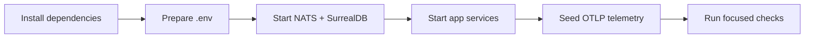

Start here when you want a working local CloudGrid stack. Use release Compose
for published images, or the source quickstart when changing CloudGrid itself.

## Path



## Pages

| Step | Page | Outcome |
| --- | --- | --- |
| 1 | [Run the release Compose stack](/handbook/getting-started/docker-compose-release) | Run CloudGrid from published images. |
| 2 | [Local quickstart](/handbook/getting-started/local-quickstart) | Run CloudGrid from source and open the UI. |
| 3 | [Send telemetry](/handbook/getting-started/send-telemetry) | Push traces, logs, and metrics through OTLP HTTP or gRPC. |
| 4 | [Verify the repository](/handbook/getting-started/verify-the-repo) | Choose the right local check before committing. |

## Minimal Commands

```sh
bun install
bun run setup:local
bun run dev:infra
bun run dev:all
```

Then open the frontend at <http://127.0.0.1:5173/>.

For release images:

```sh
./cloudgrid-local.sh up
```

Then open CloudGrid at <http://localhost:3000/>.
