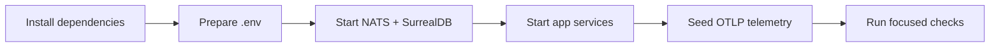

Start here when you want a working local CloudGrid stack. The local path uses
Bun, Go services, Docker Compose for NATS and SurrealDB, and no browser login.

## Path



## Pages

| Step | Page | Outcome |
| --- | --- | --- |
| 1 | [Local quickstart](/handbook/getting-started/local-quickstart) | Run CloudGrid and open the UI. |
| 2 | [Send telemetry](/handbook/getting-started/send-telemetry) | Push traces, logs, and metrics through OTLP HTTP or gRPC. |
| 3 | [Verify the repository](/handbook/getting-started/verify-the-repo) | Choose the right local check before committing. |

## Minimal Commands

```sh
bun install
bun run setup:local
bun run dev:infra
bun run dev:all
```

Then open the frontend at <http://127.0.0.1:5173/>.
