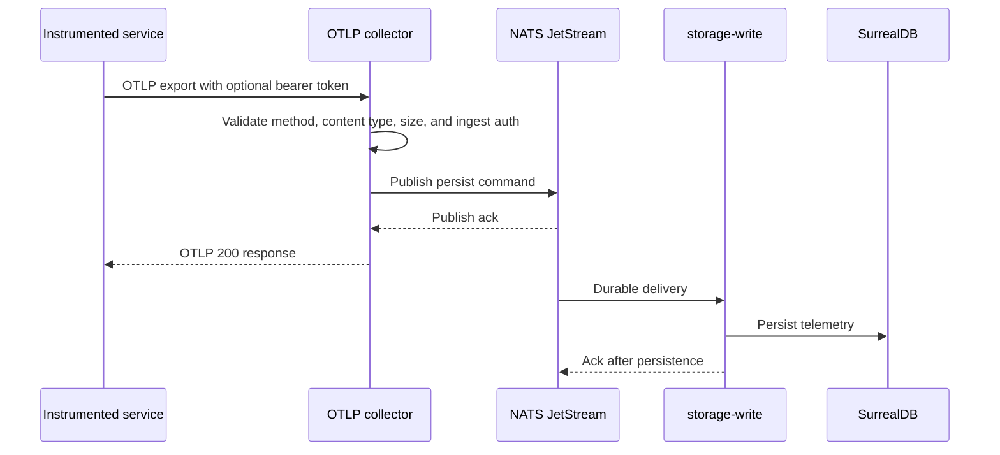

CloudGrid accepts standard OpenTelemetry traces, logs, and metrics. You do not need a CloudGrid SDK.

## Endpoints

| Signal | OTLP/HTTP endpoint | OTLP/gRPC service |
| --- | --- | --- |
| Traces | `POST http://localhost:4318/v1/traces` | `TraceService/Export` on `localhost:4317` |
| Logs | `POST http://localhost:4318/v1/logs` | `LogsService/Export` on `localhost:4317` |
| Metrics | `POST http://localhost:4318/v1/metrics` | `MetricsService/Export` on `localhost:4317` |

OTLP/HTTP accepts `application/json` and `application/x-protobuf`. OTLP/gRPC accepts protobuf.

## Use The Seed Script

For local UI development, use the seed script first:

```sh
bun run dev:seed
```

Narrow to one signal:

```sh
bun run dev:seed -- --signal traces
bun run dev:seed -- --signal logs
bun run dev:seed -- --signal metrics
```

Run a live stream:

```sh
bun run dev:seed:live
bun run dev:seed:live -- --interval-ms 1000 --max-batches 10
```

If `bun run setup:local` configured token routing, the seed script uses `CLOUDGRID_OTLP_BEARER_TOKEN`, `CLOUDGRID_OTLP_TOKEN`, or `CLOUDGRID_PROJECT_API_KEY` in that precedence order.

## Send Checked-In Fixtures

JSON fixtures:

```sh
curl -sS -H 'content-type: application/json' \
  --data @fixtures/otlp/traces.json \
  http://localhost:4318/v1/traces

curl -sS -H 'content-type: application/json' \
  --data @fixtures/otlp/logs.json \
  http://localhost:4318/v1/logs

curl -sS -H 'content-type: application/json' \
  --data @fixtures/otlp/metrics.json \
  http://localhost:4318/v1/metrics
```

Protobuf fixtures:

```sh
curl -sS -H 'content-type: application/x-protobuf' \
  --data-binary @fixtures/otlp/traces.pb \
  http://localhost:4318/v1/traces

curl -sS -H 'content-type: application/x-protobuf' \
  --data-binary @fixtures/otlp/logs.pb \
  http://localhost:4318/v1/logs
```

The repository currently includes JSON metric fixtures but not a checked-in `metrics.pb` fixture.

## Configure Local Exporters

OTLP/HTTP:

```sh
export OTEL_EXPORTER_OTLP_ENDPOINT=http://localhost:4318
export OTEL_EXPORTER_OTLP_PROTOCOL=http/protobuf
export CLOUDGRID_PROJECT_API_KEY='<local-project-token>'
```

OTLP/gRPC:

```sh
export OTEL_EXPORTER_OTLP_ENDPOINT=http://localhost:4317
export OTEL_EXPORTER_OTLP_PROTOCOL=grpc
export CLOUDGRID_PROJECT_API_KEY='<local-project-token>'
```

If local token routing is enabled, send the token as a bearer credential:

```sh
curl -sS -H 'content-type: application/json' \
  -H "authorization: Bearer ${CLOUDGRID_PROJECT_API_KEY}" \
  --data @fixtures/otlp/traces.json \
  http://localhost:4318/v1/traces
```

## What Success Looks Like

Successful OTLP/HTTP ingest returns HTTP `200` with an empty standard OTLP export response using the same encoding as the request. Successful OTLP/gRPC ingest returns the standard empty export response for the exported signal.

The collector returns after NATS JetStream publish acknowledgement. Database persistence is asynchronous. After `storage-write` persists the command, data appears in `/traces`, `/logs`, `/metrics`, `/dashboards`, and live trace mode inside `/traces`.

## Ingest Flow



## Routing Rule

Do not put CloudGrid project IDs in resource, span, log, or metric attributes for routing. Project ownership comes from validated auth context or local token mapping, not telemetry attributes.
