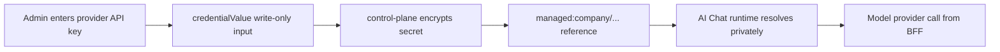

AI Chat is a project-scoped assistant surface. It appears in the project sidebar
when AI Chat is enabled and the selected company has a configured AI Chat
provider, or when the viewer is a company admin who can configure that provider.

Enable the frontend route and BFF runtime with:

```sh
CLOUDGRID_AI_CHAT_ENABLED=true
VITE_CLOUDGRID_AI_CHAT_ENABLED=true
```

Provider credentials stay outside the frontend. The browser reads only redacted
provider status and chat view models from the BFF.

## Where It Lives

Open AI Chat from the project workspace:

```text
/ai-chat
```

The route requires a selected project. The global topbar keeps the company and
project selectors; the route owns a local conversation history rail and
transcript.

Company admins configure the company AI Chat provider at:

```text
/organizations/:organizationId/ai-provider
```

This admin route is the normal setup path for AI Chat. It stores exactly one
company provider profile plus the `chat` model alias used by the AI Chat
runtime. The form accepts a provider kind, profile label, chat model,
provider-specific metadata, and a provider API key.

The key is sent once as a write-only value, stored as an encrypted company-scoped
managed secret, and shown afterward only as a `managed:` credential reference.
Leaving the API key field empty while editing keeps the current stored secret.

Operator-managed `env:NAME` and `external:provider/path` references are still
supported for automation and deployed environments, but they are no longer the
only setup path.



In deployed mode, operators must configure
`CLOUDGRID_PROVIDER_SECRET_ENCRYPTION_KEY` before managed provider secrets are
stored or resolved. See [Provider secrets](/handbook/configuration/deployed/provider-secrets).

Provider-specific fields follow the backend contract:

| Provider | Required metadata |
| --- | --- |
| OpenAI | API key or credential reference, chat model |
| Anthropic | API key or credential reference, chat model |
| Azure AI Foundry | API key or credential reference, HTTPS base URL, deployment, chat model |
| AWS Bedrock | API key or credential reference, region, chat model |
| OpenAI-compatible | API key or credential reference, HTTPS base URL, chat model |

Project-specific reusable provider profiles and model aliases belong under:

```text
/projects/:projectId/settings/ai-providers
```

## Current Frontend Surface

The frontend reads generated GraphQL contract types for:

- company AI Chat provider status;
- chat history scoped to the current user and selected project;
- persisted conversations, messages, artifacts, compaction summaries, and run
  status;
- server-issued action proposals;
- approval and rejection of action proposal IDs.
- owner-only conversation deletion. Deleting a conversation permanently removes
  that user's chat history entry and its persisted chat records.

The UI does not call model providers, NATS, SurrealDB, storage services, OTLP
endpoints, or sandbox endpoints. It does not expose raw provider traces, hidden
prompts, raw credentials, or client-local action execution.

## Artifacts And Approvals

Assistant artifacts render only when the persisted artifact uses the approved
JSON-render catalog. Unknown renderer keys are rejected by the frontend wrapper
instead of being interpreted as custom UI.

Action approvals use only server-issued `AiChatActionProposal` IDs. Medium-risk
actions can be approved or rejected inline. High-risk and destructive actions use
a confirmation dialog before approval.

## Runtime Behavior

The route renders persisted AI Chat state from GraphQL and submits prompts
through the BFF AI Chat stream endpoint. Stream events are ordered, terminal,
and scoped to the selected project and current user. The frontend can cancel an
in-flight stream, and failed conversation starts or provider runs stay visible
with retry actions in the composer. The BFF creates, updates, and finalizes a
durable run record through the control-plane bridge before streaming work, so
duplicate idempotency keys and active conversation runs are rejected from
persisted run state instead of frontend state.

For local smoke checks and automated integration tests, the BFF can use the
deterministic mock harness:

```sh
CLOUDGRID_AI_CHAT_HARNESS_MODE=mock
```

This mode exercises the full GraphQL, BFF stream, control-plane, storage, and
frontend path without sending prompts or credentials to a real provider. Keep it
disabled in production and configure the real harness/provider path instead.

The frontend still does not fake replay state or locally execute
assistant-proposed actions. It renders persisted messages and server-issued
action proposals, then submits explicit approvals back through GraphQL.
