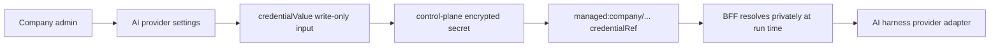

AI Chat is CloudGrid's project-scoped assistant for observability work. Use it
inside a selected project to investigate traces, logs, metrics, dashboards,
alerts, and AI-evaluation evidence that CloudGrid can already read for you.

AI Chat is not a general assistant and it is not a shortcut around CloudGrid
authorization. The browser talks to the TypeScript BFF, the BFF checks company
and project access, telemetry reads go through the approved GraphQL or
storage-read paths, and model execution runs through the CloudGrid AI harness.

## 1. Enable The Surface

Enable the BFF runtime and frontend route:

```sh
CLOUDGRID_AI_CHAT_ENABLED=true
VITE_CLOUDGRID_AI_CHAT_ENABLED=true
```

The project sidebar shows AI Chat when the feature is enabled and the selected
company has a configured AI Chat provider. If the provider is missing, company
admins see a setup action. Non-admin users see that a company admin must
configure AI Chat first.

## 2. Configure The Company Provider

Company admins configure the one provider used by AI Chat at:

```text
/organizations/:organizationId/ai-provider
```

The page stores one company AI Chat provider profile with a provider kind,
label, chat model, provider-specific metadata, bounded parameters, and a
credential reference. The normal UI path accepts the API key as a write-only
value. Control-plane encrypts it as a managed company secret and returns only a
redacted `managed:` reference to the browser.



In deployed mode, configure a stable encryption key before accepting production
provider secrets:

```sh
CLOUDGRID_PROVIDER_SECRET_ENCRYPTION_KEY='<long-random-secret>'
```

See [Provider secrets](/handbook/configuration/deployed/provider-secrets) for
secret storage, rotation, and operator-managed `env:` or `external:` references.

Supported provider setting kinds are:

| Provider kind | Required setup |
| --- | --- |
| `openai` | Credential reference or write-only key, plus a chat-capable model. |
| `anthropic` | Credential reference or write-only key, plus a chat-capable model. |
| `openai_compatible` | Credential reference or write-only key, HTTPS base URL, plus a chat-capable model. |
| `azure_foundry` | Credential reference or write-only key, HTTPS base URL, deployment, plus a chat-capable model. |
| `aws_bedrock` | Credential reference or write-only key, region, plus a chat-capable model. |

The bundled AI Chat runtime can execute `openai`, `anthropic`, and
`openai_compatible` through installed PURISTA harness adapters. `azure_foundry`
and `aws_bedrock` may be saved as provider settings, but AI Chat execution must
fail setup with a bounded provider error until matching PURISTA harness
adapters are installed and registered in the runtime catalog.

Local mode can bootstrap the Personal company's AI Chat provider from
environment variables when no stored company provider exists:

```sh
CLOUDGRID_AI_CHAT_PROVIDER_KIND=openai
CLOUDGRID_AI_CHAT_MODEL='provider-model-name'
CLOUDGRID_AI_CHAT_CREDENTIAL_REF='env:OPENAI_API_KEY'
```

Use `CLOUDGRID_AI_CHAT_BASE_URL` for `openai_compatible` and
`azure_foundry`, `CLOUDGRID_AI_CHAT_AZURE_DEPLOYMENT` for `azure_foundry`, and
`CLOUDGRID_AI_CHAT_AWS_REGION` for `aws_bedrock`. Saving company provider
settings stops using the local environment bootstrap for that company.

For Kimi K2.6 through Moonshot's OpenAI-compatible API, use the
`openai_compatible` provider kind and point the base URL at Moonshot:

```sh
CLOUDGRID_AI_CHAT_PROVIDER_KIND=openai_compatible
CLOUDGRID_AI_CHAT_MODEL=kimi-k2.6
CLOUDGRID_AI_CHAT_BASE_URL=https://api.moonshot.ai/v1
CLOUDGRID_AI_CHAT_CREDENTIAL_REF='env:MOONSHOT_API_KEY'
```

## 3. Ask Project-Scoped Questions

Open AI Chat from the project workspace:

```text
/ai-chat
```

The route requires a selected project. Chat history is scoped to the current
user and selected project, so changing projects changes the visible
conversation list. The route contains a local history rail, transcript, prompt
composer, artifact region, and approval surfaces. It does not add a second app
navigation shell.

Good questions are tied to CloudGrid evidence:

- "Why did checkout traces get slower in the last hour?"
- "Show the error logs correlated with this trace."
- "Compare request duration metrics for api and worker."
- "Summarize the failing AI Eval runs from this week."
- "Draft a dashboard from these metric series."

The composer accepts text only in v1. File attachments, screenshots,
web-search toggles, model pickers, and arbitrary tool choices are not exposed.
The active model comes from company admin configuration, not from each message.

## 4. Understand Capabilities

AI Chat can use bounded read tools for CloudGrid data:

- traces, trace details, logs, metrics, and telemetry facets;
- dashboards, alerts, alert history, and project metadata;
- AI Eval runs, datasets, dataset evaluations, comparisons, optimization
  evidence, and results.

It can also use a restricted sandbox to transform bounded tool output into
small JSON, JSONL, CSV, and render data files. The sandbox has no network, no
secrets, no host filesystem access, and no arbitrary shell execution.

Large results are capped. When tool output is too large for inline model
context, the BFF materializes a bounded sandbox file and passes only a file
handle, schema summary, row count, sample, warnings, and CloudGrid route links.
AI Chat should explain those limits instead of pretending it inspected
unavailable rows.

For local smoke checks and automated integration tests, use the deterministic
mock harness:

```sh
CLOUDGRID_AI_CHAT_HARNESS_MODE=mock
```

Mock mode exercises the BFF stream, GraphQL, control-plane, storage, and
frontend path without calling a real provider. Do not use it as a production
provider substitute.

## 5. Read Artifacts

Assistant text is sanitized Markdown. Structured outputs are persisted
JSON-render artifacts validated by the BFF before the frontend renders them.

Approved renderer keys are:

| Renderer | Use |
| --- | --- |
| `metric_timeseries`, `metric_bar` | Metric charts and grouped comparisons. |
| `table`, `key_value`, `status_summary` | Sortable evidence and concise summaries. |
| `trace_waterfall` | Span timing and critical path views. |
| `log_list` | Bounded log evidence. |
| `mermaid`, `json_tree`, `diff` | Diagrams, structured JSON, and comparison output. |
| `action_approval` | Server-issued approval cards. |

Markdown transcript export serializes trusted artifacts as fenced code blocks
with the `cloudgrid-json-render:<renderer>` info string. The frontend renders
that fence as an artifact only when it comes from a persisted BFF artifact part
for the current conversation. User-authored or model-authored matching fences
without a persisted artifact ID remain inert code blocks.

## 6. Approve Actions Deliberately

AI Chat may propose actions, but it cannot execute arbitrary mutations from
assistant text. Executable actions must be server-issued
`AiChatActionProposal` records and must use an allowlisted action kind.

Risk levels:

| Risk | Behavior |
| --- | --- |
| `low` | Read-only navigation suggestions, filter suggestions, or draft-only artifact creation. Approval is not required. |
| `medium` | Non-destructive project artifacts such as dashboards, datasets, evaluations, and alert rules. Approval is required. |
| `high` | Retention, provider, budget, policy, project, or membership changes. Approval is required and changed fields must be visible. |
| `destructive` | Delete, revoke, disable, archive, or removal actions. Approval is required through destructive confirmation. |

After approval, the BFF rechecks authorization and resource versions before
executing the whitelisted mutation or control-plane action. Stale actions fail
instead of retrying mutated input. Secret-returning actions, including creating
new ingest credentials, are not executable from AI Chat v1.

## 7. Security Boundaries

AI Chat must stay inside CloudGrid's existing architecture:

- Frontend talks only to the TypeScript BFF.
- The BFF does not import SurrealDB clients or expose REST telemetry reads.
- Telemetry semantics stay with storage-read.
- Provider calls go through PURISTA harness adapters.
- The model never receives provider credentials, company IDs, project IDs,
  user IDs, tenant IDs, authorization claims, NATS subjects, SurrealQL, raw
  GraphQL documents, arbitrary URLs, host paths, or environment variable names
  as controllable inputs.

The BFF refuses clearly out-of-scope requests before provider execution,
including requests for hidden prompts, policies, tool schemas, chain-of-thought,
credentials, tokens, provider request or response bodies, and unrelated general
knowledge topics.

## 8. Observe The Runtime

AI Chat emits logs and optional OTLP spans or metrics through CloudGrid
self-observability. Runtime metrics include run counts, duration, tool calls,
sandbox scripts, sandbox failures, action proposals, approvals, compactions,
and token counts.

Tracing is controlled by:

```sh
CLOUDGRID_AI_CHAT_TRACING_ENABLED=true
```

Local mode defaults tracing on. Deployed mode defaults tracing off unless the
operator enables it. Production harness telemetry uses content capture disabled:
logs, spans, metrics, stream events, and persisted artifacts must not include
prompt text, raw tool payloads, sandbox file contents, provider request or
response bodies, credentials, cookies, authorization headers, or hidden
reasoning.

## 9. Extend AI Chat

Extension work starts from the specs and catalog contract, not from a local UI
shortcut. Read:

- `specs/04-backend/ai-chat.md`
- `specs/04-backend/ai-provider-settings.md`
- `specs/04-backend/ai-runtime-structure.md`
- `specs/04-backend/ai-chat-implementation-contract.md`
- `specs/05-frontend/ai-chat-views.md`

The BFF runtime catalog owns model aliases, provider adapter bindings, tools,
renderer keys, action kinds, mounted skills, and budgets. Do not maintain a
second hard-coded list in stream handlers, frontend fixtures, or tests.

Specialist CloudGrid skills live in `skills/` and are mounted read-only for
allowlisted AI Chat agents. Keep skills concise, one level deep, and grounded
in specs. The repository tracks local skill authoring rules in `skills/README.md`
and follows the upstream
[Skill authoring best practices](https://platform.claude.com/docs/en/agents-and-tools/agent-skills/best-practices).

Run the focused checks for the surface you changed. For docs and skill-only
changes, use:

```sh
bun run --cwd website build
bun run skills:check
```
