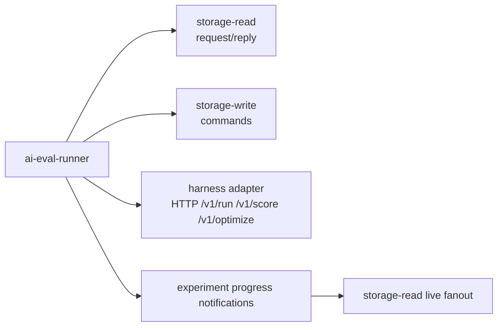

AI evaluation is an optional CloudGrid enhancement for teams that emit OpenTelemetry from AI agents.

Enable surfaces and runner integration with:

```sh
CLOUDGRID_AI_EVAL_ENABLED=true
CLOUDGRID_AI_EVAL_HARNESS_URL=http://localhost:8090
```

The AI Eval sidebar entry appears after Dashboards when enabled. The route is
project scoped; select a project before opening `/ai-eval`.

## What It Adds

CloudGrid keeps the core trace/log/metric explorer intact and adds AI-specific workflows:

- agent run, model call, tool call, and retrieval projections from OTel GenAI and OpenInference attributes;
- datasets built from observed traces and spans;
- scorers for deterministic checks, RAG metrics, LLM judges, and human review;
- offline experiment runs through a configured harness adapter;
- prompt optimization through harness workflows;
- annotation queues for turning failures into regression cases.

## Runner Boundary

`core/ai-eval-runner` is optional and stays behind the private message bridge.



The runner must not import SurrealDB clients, storage adapters, model-provider SDKs, provider credentials, or public HTTP handlers.

## Project Settings

Project-level AI Eval configuration lives at:

```text
/projects/:projectId/settings/ai-eval
```

Settings use `Query.projectAiSettings` and `Mutation.updateProjectAiSettings` for project enablement, provider profile metadata, model aliases, online policy, and daily budget state.

Raw provider API keys, bearer tokens, refresh tokens, cookies, Authorization
headers, and provider secret JSON must not be returned, logged, or bundled.
Project provider profiles may use encrypted `managed:` credential references
when configured through CloudGrid. Offline harness provider credentials remain
owned by the harness deployment.

## First Setup

Use this order for a new project:

1. Enable AI Eval in Project Settings / AI Eval.
2. Add or confirm a harness/provider profile for offline runs.
3. Create a dataset in `/ai-eval?tab=datasets`.
4. Add rows manually, import a file, or review dataset candidates.
5. Create at least one scorer in `/ai-eval?tab=scorers`.
6. Create an experiment in `/ai-eval?tab=experiments` and run it.
7. Add an online production policy only after deterministic offline runs are useful.

Local development can use the bundled dev harness:

```sh
bun tooling/scripts/ai-eval-dev-harness.mjs
```

The harness keeps model or provider credentials outside the BFF and frontend.

## Dataset Import And Export

Dataset import is staged:

1. Upload `.jsonl`, `.json`, `.csv`, or `.zip` through the BFF upload endpoint.
2. Select included files when a ZIP contains multiple supported files.
3. Map columns or JSON paths to dataset fields.
4. Preview with `Mutation.prepareDatasetImport`.
5. Commit with `Mutation.commitDatasetImport`.

Dataset export:

1. Choose `jsonl`, `json_array`, or `csv`.
2. Filter by split or review status when needed.
3. Start with `Mutation.startDatasetExport`.
4. Download from the returned same-origin `downloadUrl`.

The frontend does not parse uploaded rows into dataset items, infer mappings, deduplicate records, or compute dataset health.

## Dataset Candidates

Dataset candidates are review items created from production measurements,
failed experiment items, coverage gaps, health issues, failure clusters, or
selected traces. They are never committed automatically.

Candidate review shows the source, reason, proposed input and expected output,
target shape, split, review status, duplicate/cluster context, and content
treatment. Realistic anonymization displays policy id/version and transformed
field classes such as email, phone, URL, id, or address. Original sensitive
values should not appear after transformation.

Use:

- `Query.datasetCandidates` to list suggested candidates.
- `Mutation.prepareDatasetCandidates` to prepare candidates from approved sources.
- `Mutation.commitDatasetCandidates` to append selected candidates to the next dataset version.

Commit requires the current dataset version. If another user or import changes
the dataset first, reload the dataset and retry with the new version.

## Scorers

Create scorers from typed templates instead of raw JSON. Common v1 templates
include exact/contains/regex checks, JSON schema validation, semantic similarity,
RAG faithfulness, LLM judge rubrics, tool correctness, trajectory/workflow
completion, human review, and composites.

Deterministic scorers are the safest first choice because they can run offline
and can be used by production online policies in v1. LLM judge and semantic
scorers require provider profiles, budget, timeout, and latency allowances.

## Experiment Runs

Experiments bind a dataset version, scorers, and a solver reference. Starting a
run creates an immutable run manifest. The UI shows returned run summaries,
score visualizations, item counts, latency, cost/token budget use, regression
markers, and model-quality versus item-quality problem counts.

Run controls are status-aware:

- queued/running/resuming runs can be cancelled;
- running/resuming runs can be paused;
- paused runs can be resumed;
- completed, cancelled, and failed runs are historical records.

Pause and resume are idempotent run-control requests. Repeating the same action
should not create a second logical control operation.

## Production Quality

Production quality is read-only monitoring in the AI Eval workspace. Policy
setup lives in Project Settings / AI Eval. Online scoring is inactive by default
and each policy must be explicitly enabled with a target filter, sample rate,
scorers, and limits.

The production view reads `Query.aiQualityOverview` and displays returned
segments, skipped reasons, quality trend, cost trend, latency trend, regression
counts, and candidate suggestions. It does not create alert rules or annotation
queue items automatically in v1.

## Operational Limits

Default verification and local integration should be hermetic. They must not
require external provider credentials, durable replay services, cloud storage,
or production deployments.

Recommended operator limits:

- keep online sample rates low until scorer cost and latency are known;
- set daily and per-run budget limits before enabling provider-backed scorers;
- cap max parallel experiment items to protect harness and provider quotas;
- use deterministic scorers for production policies unless provider-backed
  scorer requirements are explicitly satisfied;
- treat dataset imports as versioned commits, not in-place edits.

## Troubleshooting

AI Eval entry is missing:

- Check `CLOUDGRID_AI_EVAL_ENABLED` and `VITE_CLOUDGRID_AI_EVAL_ENABLED`.
- Confirm a project is selected.

Experiment run does not start:

- Confirm the dataset has a version and at least one usable item.
- Confirm at least one scorer exists.
- Check Project Settings / AI Eval for provider or budget warnings.
- Check runner and harness logs; the BFF only bridges GraphQL to NATS.

Candidate commit fails:

- Reload the dataset and retry with the latest dataset version.
- Check candidate status; committed or dismissed candidates should not be reused.

Production quality is empty:

- Confirm an online policy is enabled.
- Check policy target filters and sample rate.
- Look for skipped reasons in `aiQualityOverview`.
- Confirm storage-read and the runner are available through the message bridge.

## Offline Runner Tests

Runner-only scaffold tests:

```sh
cd core/ai-eval-runner
GOWORK=off go test ./...
```

Use `GOWORK=off` because the root `go.work` may not include the runner module in all implementation waves.

## Next Step

Read the implementation specs for AI eval before adding behavior: [AI eval domain](/handbook/reference/contracts).
