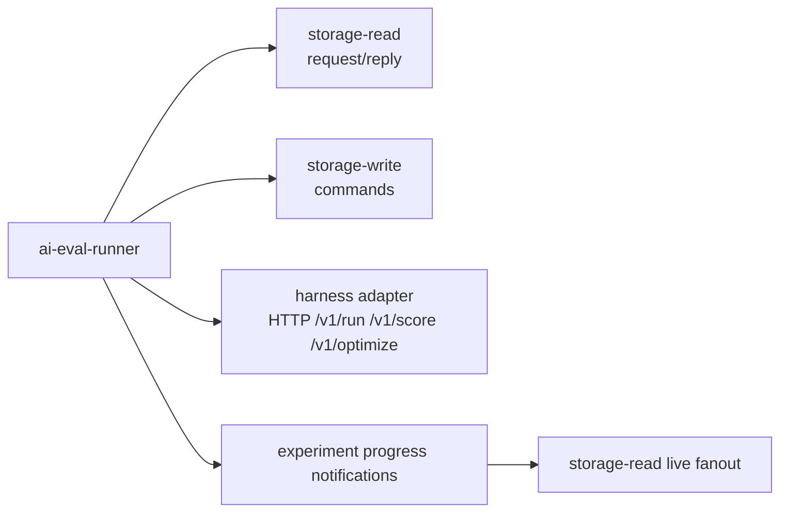

AI evaluation is an optional CloudGrid enhancement for teams that emit OpenTelemetry from AI agents.

Enable surfaces and runner integration with:

```sh
CLOUDGRID_AI_EVAL_ENABLED=true
CLOUDGRID_AI_EVAL_HARNESS_URL=http://localhost:8090
```

The AI Eval sidebar entry appears after Dashboards when enabled.

## What It Adds

CloudGrid keeps the core trace/log/metric explorer intact and adds AI-specific workflows:

- agent run, model call, tool call, and retrieval projections from OTel GenAI and OpenInference attributes;
- datasets built from observed traces and spans;
- scorers for deterministic checks, RAG metrics, LLM judges, and human review;
- offline experiment runs through a configured harness adapter;
- prompt optimization through harness workflows;
- annotation queues for turning failures into regression cases.

## Runner Boundary

`core/ai-eval-runner` is optional and stays behind the private message bridge.



The runner must not import SurrealDB clients, storage adapters, model-provider SDKs, provider credentials, or public HTTP handlers.

## Project Settings

Project-level AI Eval configuration lives at:

```text
/projects/:projectId/settings/ai-eval
```

Settings use `Query.projectAiSettings` and `Mutation.updateProjectAiSettings` for project enablement, provider profile metadata, model aliases, online policy, and daily budget state.

Raw provider API keys, bearer tokens, refresh tokens, cookies, Authorization headers, and provider secret JSON must not be persisted, returned, logged, or bundled.

## Dataset Import And Export

Dataset import is staged:

1. Upload `.jsonl`, `.json`, `.csv`, or `.zip` through the BFF upload endpoint.
2. Select included files when a ZIP contains multiple supported files.
3. Map columns or JSON paths to dataset fields.
4. Preview with `Mutation.prepareDatasetImport`.
5. Commit with `Mutation.commitDatasetImport`.

Dataset export:

1. Choose `jsonl`, `json_array`, or `csv`.
2. Filter by split or review status when needed.
3. Start with `Mutation.startDatasetExport`.
4. Download from the returned same-origin `downloadUrl`.

The frontend does not parse uploaded rows into dataset items, infer mappings, deduplicate records, or compute dataset health.

## Offline Runner Tests

Runner-only scaffold tests:

```sh
cd core/ai-eval-runner
GOWORK=off go test ./...
```

Use `GOWORK=off` because the root `go.work` may not include the runner module in all implementation waves.

## Next Step

Read the implementation specs for AI eval before adding behavior: [AI eval domain](/handbook/reference/contracts).
