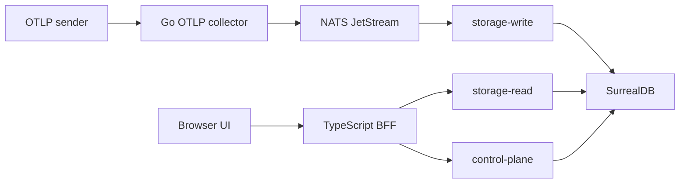

CloudGrid is an OTLP observability workspace for project-scoped traces, logs, metrics, live trace receiving, dashboards, ingest credentials, retention policies, alert management, and optional AI evaluation workflows.

This documentation is written as a storyline. Start with the product model, run a local stack, configure the runtime, send telemetry, investigate the data, then operate the services.

## Reading Path

| Step | Read | Outcome |
| --- | --- | --- |
| 1 | [What CloudGrid is](/handbook/overview/what-is-cloudgrid) | Understand the product boundary and the current implementation status. |
| 2 | [Runtime modes](/handbook/overview/runtime-modes) | Choose local mode or deployed SSO mode. |
| 3 | [Local quickstart](/handbook/getting-started/local-quickstart) or [release Compose](/handbook/getting-started/docker-compose-release) | Run CloudGrid locally and open the UI. |
| 4 | [Send telemetry](/handbook/getting-started/send-telemetry) | Push traces, logs, and metrics through the real OTLP collector. |
| 5 | [Configuration](/handbook/configuration) | Set local, deployed, SSO, storage, and self-observability values. |
| 6 | [Guides](/handbook/guides/ingest-otlp) | Use project API keys, traces, logs, metrics, dashboards, and AI eval. |
| 7 | [Operations](/handbook/operations) | Start, stop, monitor, troubleshoot, and prepare for production. |
| 8 | [Reference](/handbook/reference) | Look up commands, ports, environment variables, routes, and contracts. |

## Handbook Tree

```text
handbook/
  overview/                 Product model and runtime modes
  getting-started/          Source quickstart, release Compose, and first telemetry
  concepts/                 Companies, projects, telemetry, access, live data
  configuration/
    local/                  Local mode, token routing, self-observability
    deployed/
      sso/                  GitHub, Google, and Azure Entra ID SSO
  guides/                   Task-focused user workflows
  operations/               Health, reset, bridge monitoring, troubleshooting
  architecture/             Public/private service boundaries and flows
  reference/                Lookup tables for commands, env vars, ports, routes
```

## System Thumbnail



The browser talks only to the TypeScript BFF. Public telemetry reads use GraphQL. The BFF talks to private services through NATS request/reply. The collector publishes ingest commands and never writes SurrealDB directly. Only `storage-write` mutates telemetry, and only `storage-read` fetches telemetry.

## Source Of Truth

User-facing docs explain how to use and operate CloudGrid. Implementation behavior is defined by the contract and spec sources summarized in [Contracts](/handbook/reference/contracts). If a feature is not specified and implemented, the handbook must not present it as available.
